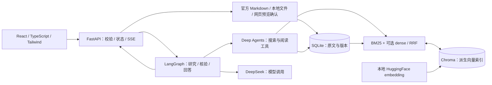
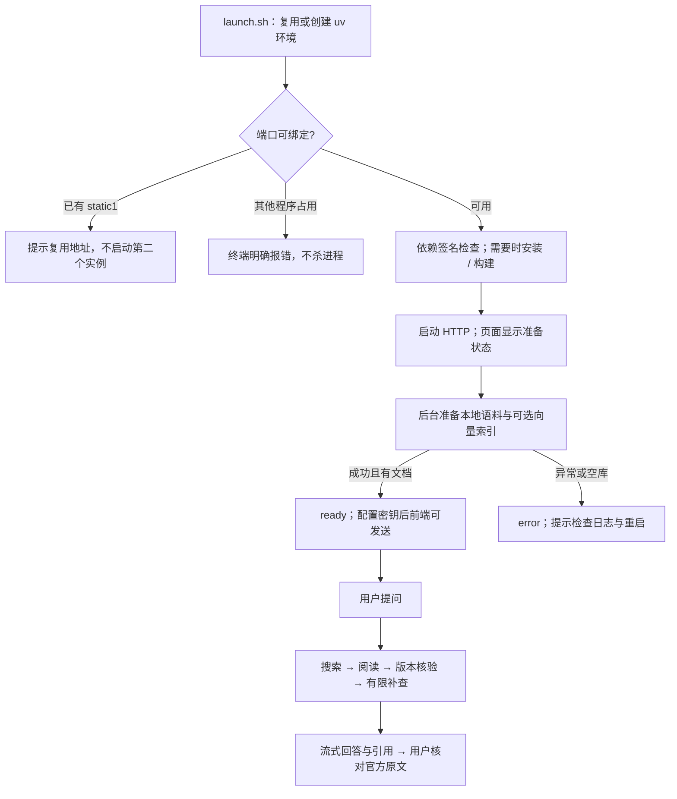

# HLD：本地文档助手的系统架构

> 文档归属：static1。2026-09-16 从 `static1/HLD.md` 迁入。本文件是此主题的唯一维护入口。正文中的源码路径以仓库根目录或明确标注的 static1 目录为基准，不以本文目录为基准。

下一阶段的目标架构与实验顺序见 [Agentic RAG 提升计划](../static1_plan/roadmap.md) 第4、8节；其内容为规划，本文仍描述已实现系统，不提前把目标节点画成现状。

维护日期：2026-09-15。本文描述已实现边界；模块、状态和故障契约见 [LLD.md](LLD.md)，上游源码映射和完整接口见 [API_PIPELINE.md](API_PIPELINE.md)。

## 目标与非目标

用户打开浏览器即可阅读本地官方文档、提问并核对出处；准备期间可见进度，不把未就绪误报为聊天失败。单用户、单服务进程，默认仅监听本机。不实现登录、云端托管线程或多进程任务协调，不改变既定技术栈。

## 系统边界

SQLite 是可引用原文的事实来源；向量索引可以重建，不能代替读取正文。没有 `embedding_path` 时使用 BM25，不加载 embedding。官方语料为公开 Python LangChain、LangGraph、Deep Agents 分区，并非上游私有知识库或全站镜像。

## 工作流程 work-pipeline

## 稳定性边界

- 端口预检查不是端口预留；预检查后的竞争仍可能由 Uvicorn 报错。端口被外部程序占用时，本应用无法提供自己的错误网页。
- HTTP 可用、检索就绪、模型可用是三个不同条件。健康接口不主动调用模型；密钥存在不等于密钥有效。
- 本地模型首次索引可能耗时较长；已落盘批次可以复用，不承诺 CPU 初始化时限。
- 任务状态在内存中，正文和向量在磁盘中。仅支持一个写入服务进程；取消异步等待不能强制停止正在执行的线程内模型计算。
- 更新失败保留旧正文；版本核验仅证明证据快照一致，不证明答案语义正确。模型效果和网页端对照需要独立验收。

## 维护规则

系统边界或部署方式变化先更新本文；状态、接口、持久化规则变化更新 LLD；每个节点把实际验证和未验证内容记入 dev_logs。不要把规划写成已实现，也不要为修改启动逻辑反复调查上游云端细节。
