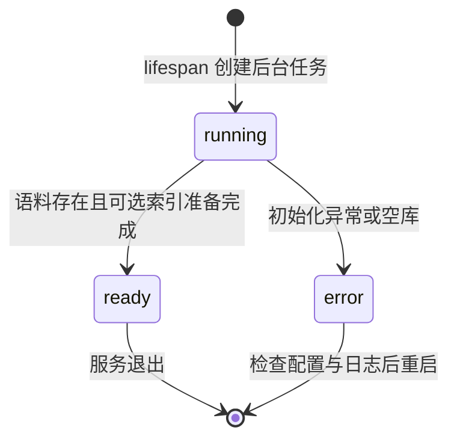

# LLD：模块、接口、数据与状态

> 文档归属：static1。2026-09-16 从 `static1/LLD.md` 迁入。本文件是此主题的唯一维护入口。正文中的源码路径以仓库根目录或明确标注的 static1 目录为基准，不以本文目录为基准。

下一阶段的结构化证据、缺口路由和共享预算契约见 [Agentic RAG 提升计划](../static1_plan/roadmap.md) 第5、6节；这些是拟议契约，尚未替代本文现有接口。

维护日期：2026-09-15。系统边界见 [HLD.md](HLD.md)。本文重点维护启动和就绪契约，完整业务 API 见 [API_PIPELINE.md](API_PIPELINE.md)。

## 1. 模块职责

| 模块 | 输入 / 输出 | 责任边界 |
|---|---|---|
| launch.sh / launcher.py | 环境、端口、依赖签名 → 运行进程或明确退出 | uv 环境优先复用；依赖未变化跳过安装；不终止已有程序 |
| main.py | HTTP 请求 → JSON / SSE | 生命周期、输入校验、就绪门禁、进程内导入锁 |
| official_docs.py / parsers.py | 文档来源 → Document | 解析、官方分区发现、逐页写入；网页需预览确认 |
| knowledge.py | Document / 查询 → 版本快照 / 检索定位 | SQLite 持久化、BM25、读取指定版本 |
| dense.py | 本地模型、片段 → 向量候选 | 模型懒加载、Chroma 增量同步与进度 |
| agent/graph.py | 历史消息 → 研究事件、证据、答案 | 限定工具、有限补查、版本核验；不负责 HTTP |
| frontend/src/api.ts / main.tsx | 健康 JSON / SSE → 页面状态 | 加载提示、发送门禁、流协议、错误展示 |

## 2. 数据与缓存

`knowledge.sqlite3` 的 docs 表保存 id、version、payload。id 来自来源地址哈希，version 来自页面内容哈希；相同来源更新替换正文。引用携带版本，读取不匹配的版本报错，不悄悄引用新正文。

Chroma 保存派生片段；片段标识包含定位和文本信息，模型配置及文件签名隔离索引。同步新增片段并移除失效片段。健康轮询通过 `COUNT(*)` 统计文档，不读取和反序列化整库正文。

依赖安装标记保存于选定虚拟环境，包含项目路径、Python 版本、pyproject.toml 和 extras。`UPDATE_DEPS=1` 强制安装；此签名不是锁文件，也不能自动识别环境被外部命令破坏。前端现有产物需用 `REBUILD_FRONTEND=1` 强制重新构建；后端改动需要重启进程。

## 3. 准备状态机

启动发现已有 official 文档时复用，不自动全量更新；没有时尝试导入三个官方分区。部分抓取失败而已有可用文档可以 ready；空库不能 ready。测试注入 Knowledge 时跳过启动准备，生命周期测试另行覆盖真实准备分支。

`index_progress` 是独立子状态：waiting / loading_model / indexing / ready，附 completed、total。无 embedding 时为 null。它不是服务可用性的替代判断；前端只依据 preparation 和密钥配置启用发送。

## 4. 状态与错误接口

| 接口 / 条件 | 响应与客户端动作 |
|---|---|
| GET /api/health | 200；status、app_id、model、docs_count、api_key_configured、web_provider、preparation、index_progress |
| preparation=running 或 error 时 POST /api/chat | 503，detail 为加载中或失败提示，Retry-After: 3；不创建问答图 |
| 初始化期间官方更新、本地导入、网页确认 | 409；避免与初始化重复写入；稍后由用户重试 |
| 官方更新任务已运行时再次启动 | 409；原任务继续 |
| 流建立后模型失败 | SSE error，不发送 done；前端不把失败回答作为完整历史 |
| 流正常完成 | SSE done；来源和 token 按流事件展示 |

前端约每3秒检查健康状态，单次请求5秒超时；断连后禁用发送并自动重连。准备失败需要检查终端并重启，不做无限自动重试。官方任务 status 与 preparation 分开：前者描述一次抓取任务，后者描述启动可用性。

## 5. 并发、更新与已知限制

导入操作共享进程内 asyncio.Lock；向量同步使用线程锁。初始化期间拒绝修改语料，但普通更新后尚未提供独立“索引更新完成”任务状态：后续检索可能触发向量增量同步。这是下一步需要针对实测等待时间完善的边界，不能宣称所有更新都已后台预热。

当前没有持久任务队列、热配置或准备失败的一键恢复。关闭服务取消异步任务，不保证立即中断线程内 embedding。不要并行启动多个进程写同一知识库；不要为关闭索引任务杀死不属于本应用的进程。

## 6. 验证入口

- tests/test_app.py：正常 JSON/SSE、准备期503与写入409、轻量健康检查、后台准备成功/空库/异常。
- tests/test_launcher.py 和 test_launch.py：安装缓存、端口冲突、环境选择。
- tests/test_dense.py：向量复用与失效片段、无 embedding、融合行为。
- 真实模型、完整本地模型索引性能和浏览器问答是独立验收，不以假模型单元测试替代。
