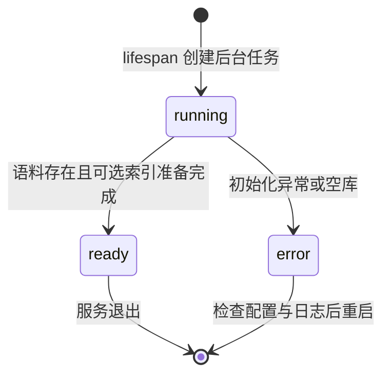

# LLD：模块、接口、数据与状态

> 文档归属：static1。2026-09-16 从 `static1/LLD.md` 迁入。本文件是此主题的唯一维护入口。正文中的源码路径以仓库根目录或明确标注的 static1 目录为基准，不以本文目录为基准。

结构化报告和基础缺口路由已按本文第8节实现；完整任务契约、共享token预算等仍见 [Agentic RAG 提升计划](../static1_plan/roadmap.md) 第5、6、11节，不将完整规划当作已实现。

维护日期：2026-09-15。系统边界见 [HLD.md](HLD.md)。本文重点维护启动和就绪契约，完整业务 API 见 [API_PIPELINE.md](API_PIPELINE.md)。

## 1. 模块职责

| 模块 | 输入 / 输出 | 责任边界 |
|---|---|---|
| launch.sh / launcher.py | 环境、端口、依赖签名 → 运行进程或明确退出 | uv 环境优先复用；依赖未变化跳过安装；不终止已有程序 |
| main.py | HTTP 请求 → JSON / SSE | 生命周期、输入校验、就绪门禁、进程内导入锁 |
| official_docs.py / parsers.py | 文档来源 → Document | 解析、官方分区发现、逐页写入；网页需预览确认 |
| knowledge.py | Document / 查询 → 版本快照 / 检索定位 | SQLite 持久化、BM25、读取指定版本 |
| dense.py | 本地模型、片段 → 向量候选 | 模型懒加载、Chroma 增量同步与进度 |
| agent/routing.py | 消息、配置、文档目录 → 生效策略 | 严格枚举、有限分类、资料解析、失败回退、回答证据约束 |
| agent/graph.py | 历史消息 → 策略、研究事件、证据、答案 | understand → direct 或 research → validate → answer → finish；不负责 HTTP |
| frontend/src/api.ts / main.tsx | 健康 JSON / SSE → 页面状态 | 加载提示、发送门禁、流协议、错误展示 |

## 2. 数据与缓存

`knowledge.sqlite3` 的 docs 表保存 id、version、payload。id 来自来源地址哈希，version 来自页面内容哈希；相同来源更新替换正文。引用携带版本，读取不匹配的版本报错，不悄悄引用新正文。

Chroma 保存派生片段；片段标识包含定位和文本信息，模型配置及文件签名隔离索引。同步新增片段并移除失效片段。健康轮询通过 `COUNT(*)` 统计文档，不读取和反序列化整库正文。

依赖安装标记保存于选定虚拟环境，包含项目路径、Python 版本、pyproject.toml 和 extras。`UPDATE_DEPS=1` 强制安装；此签名不是锁文件，也不能自动识别环境被外部命令破坏。前端现有产物需用 `REBUILD_FRONTEND=1` 强制重新构建；后端改动需要重启进程。

## 3. 准备状态机

启动发现已有 official 文档时复用，不自动全量更新；没有时尝试导入三个官方分区。部分抓取失败而已有可用文档可以 ready；空库不能 ready。测试注入 Knowledge 时跳过启动准备，生命周期测试另行覆盖真实准备分支。

`index_progress` 是独立子状态：waiting / loading_model / indexing / ready，附 completed、total。无 embedding 时为 null。前端依据HTTP连接与密钥配置启用发送，preparation单独决定能否进入研究；密钥存在不证明模型连通。

## 4. 状态与错误接口

| 接口 / 条件 | 响应与客户端动作 |
|---|---|
| GET /api/health | 200；status、app_id、model、docs_count、api_key_configured、web_provider、preparation、index_progress |
| preparation=running 或 error 时 POST /api/chat | 正常建立流；直接交流不访问语料，研究路径返回不可用提示，不启动研究工具 |
| 初始化期间官方更新、本地导入、网页确认 | 409；避免与初始化重复写入；稍后由用户重试 |
| 官方更新任务已运行时再次启动 | 409；原任务继续 |
| 流建立后模型失败 | SSE error，不发送 done；前端不把失败回答作为完整历史 |
| 流正常完成 | SSE done；来源和 token 按流事件展示 |

前端约每3秒检查健康状态，单次请求5秒超时；断连后禁用发送并自动重连。准备失败需要检查终端并重启，不做无限自动重试。官方任务 status 与 preparation 分开：前者描述一次抓取任务，后者描述启动可用性。

## 5. 并发、更新与已知限制

导入操作共享进程内 asyncio.Lock；向量同步使用线程锁。初始化期间拒绝修改语料，但普通更新后尚未提供独立“索引更新完成”任务状态：后续检索可能触发向量增量同步。这是下一步需要针对实测等待时间完善的边界，不能宣称所有更新都已后台预热。

当前没有持久任务队列、热配置或准备失败的一键恢复。关闭服务取消异步任务，不保证立即中断线程内 embedding。不要并行启动多个进程写同一知识库；不要为关闭索引任务杀死不属于本应用的进程。

## 6. 验证入口

- tests/test_app.py：正常 JSON/SSE、准备状态传递与写入409、轻量健康检查、后台准备成功/空库/异常；test_query_routing.py覆盖按能力分流。
- tests/test_launcher.py 和 test_launch.py：安装缓存、端口冲突、环境选择。
- tests/test_dense.py：向量复用与失效片段、无 embedding、融合行为。
- 真实模型、完整本地模型索引性能和浏览器问答是独立验收，不以假模型单元测试替代。

## 7. 答案交互与浏览器耗时（2026-09-16）

前端 `conversation.ts` 管理Turn/Attempt和纯状态转换，`Answer.tsx` 展示Markdown、复制、来源与耗时，`main.tsx` 调度请求与旧版本。A批次增量请求选项与policy事件见API_PIPELINE。

Attempt记录answer/sources/complete/outcome、startedAt（日期）、firstTokenMs/totalMs/elapsedMs（可空数值）。持续时间使用浏览器单调时钟performance.now。状态running→completed/cancelled/failed，终态不受后续事件修改。首个非空token设置firstTokenMs一次；done设置totalMs和elapsedMs；异常/取消仅设置elapsedMs。运行中计时刷新局限于计时组件，不逐帧重绘答案全文。

Turn另存requestMessages快照和previousAttempts。只有最新一轮可重新生成，重新从此前生效且完整的版本构造role/content，不信任旧请求快照；旧Attempt归档，新Attempt计时重置为未知。下一轮仅携带最新完整版本；旧版本和来源面板仅查看/复制/导出，不自动进入请求。所有状态仍仅在页面内存中。

SSE解析器收到成功done后立即返回并释放读取器；不等待EOF，不处理done后的token。停止按钮阻止表单默认提交，避免取消时按钮切换成发送按钮而意外发送草稿。复制使用Clipboard API，拒绝时明确提示失败。

验证入口：frontend/src/conversation.test.mts、api.test.mts和tests/browser_answer_controls.py；后者用生产构建、受控流和本地静态服务器，不调用模型。Think口径与后续usage规则详见roadmap第11节。

## 8. 研究交接、隔离与硬停止（2026-09-16）

`agent/evidence.py`定义ResearchReport/Assessment及路由。每项包含question、status、evidence_ids、gap、next_action、detail；最多8个子问题。report不是事实来源，只有实际read_doc正文可引用。evidence_id绑定doc_id/page/start_line/version，截断为16位SHA256标识；读同一片段复用，版本变化不复用。

默认增加两个业务工具：finish_research接收结构化报告并return_direct结束内层Agent；check_corpus_page只接受用户消息或已读正文中出现的docs.langchain.com URL，核对本地origin（归一化.md、锚点与查询参数）。搜索未命中、模型自报缺页、模型编造URL均不能触发硬停止。当前没有问答时联网补页能力，不声称实时核验远程页面是否存在或网络是否可用。

空目录，或核验所需URL未收录后设置blocked，退出内层Agent；工具锁保护检查与知识库操作，排队搜索/阅读检查blocked后不再执行。blocked保存source、reason及受影响question。外层validate继续检查已有证据版本并保留有效项，preserve_blocked_report记录缺失子问题。无有效证据时给固定补材料提示；有有效证据时仅调用答案模型交付支持部分并说明缺项，不重新开放搜索或读取。

正常交接合并旧子问题与新报告，补查不得通过删除旧未解决项获得covered。validate移除失效证据，对非法/空ID的supported/partial降级；未核验corpus_missing改为unknown；输出gap强制answer、条件gap强制clarify。报告未交接或合并超8项则handoff_missing，停止而不默认为充分。

路由依次检查blocked、交接缺失、全覆盖、轮数、无新增证据、阅读上限、可执行补查和查询上限。最多6段阅读，MAX_SEARCHES默认6个不同查询（全run共享），MAX_ROUNDS默认2；第一轮缺口允许一次修复，之后无新增证据停止。EVIDENCE_ROUTING默认true，false使用旧两工具与非空证据路由。

HTTP层ChatRequest/ChatMessage禁止额外字段。每次创建新图状态evidence=[]/searches={}/rounds=0/report=None/blocked=None，无checkpointer恢复旧研究。前端版本选择的真实性由前端构造保证；服务端不声称能辨认纯文本里人为粘贴的旧答案。

测试：test_evidence_routing.py覆盖部分覆盖、重复循环、无效引用、预算、子问题保留、缺页判断和真实Deep Agents图的终止行为；test_app.py覆盖旧状态字段拒绝与新请求状态独立；前端测试污染旧requestMessages后仍正确重建。

## 9. A 批次策略与答案版本契约

`routing.py`中TurnOptions定义auto/knowledge_only、low/middle/high及可空allowed_doc_ids；Intent使用Literal校验route与intent。分类最多等待8秒，受外层run_timeout约束。坏JSON/非法枚举/局部超时回退研究，服务异常明确提示，取消不回退。问候有确定性短路径，knowledge_only且无需资料指代解析时省略分类调用。

资料标题/URL必须实际出现在用户消息中，且能唯一对应目录；不存在与歧义分别说明。允许ID在进入研究前验证；search在排序前排除范围外文档，read再次检查。限定搜索只使用BM25，不把子集同步到共享Chroma。high非社交问题重新查证，不将历史助手文本当作新证据。

Attempt新增请求options与可空服务端policy。每版保存自己的策略；重新生成从policy提取选项（未收到policy时用原options），重新创建研究状态。取消/失败保留已有policy与对应outcome；没有收到policy时保持null，不猜测执行路径。

`QUERY_ROUTING`、`EVIDENCE_LEVEL`是服务默认，前端首次读取health.defaults初始化会话设置；本轮传入值覆盖默认，明确“仅按资料”再收紧。low不能解除指定资料范围。UI设置用于新问题，默认重新生成沿用原版本。

### B/C/D 增量接口（2026-09-17）
- chat 新增 execution_mode: auto/quick/research；SSE新增 telemetry（阶段耗时、搜索/阅读计数）与 usage（实际调用数、已报告/完整用量）。
- GET documents/{id}?section=true 保留旧坐标，按章节/代码块读取，携带版本与截断标识。
- POST ingest/text 接收 title/origin/text；同来源更新文档。
- GET workspace/sessions|notes；PUT workspace/{kind}/{id} 接收 revision/title/data，revision冲突返回409，单记录上限4MB。独立SQLite持久化。
- 前端 workspace.ts 管理恢复及串行保存，Notes.tsx 管理人工笔记，SourceManager.tsx 管理来源范围和正文补充。笔记仅导航，不注入为事实来源。
