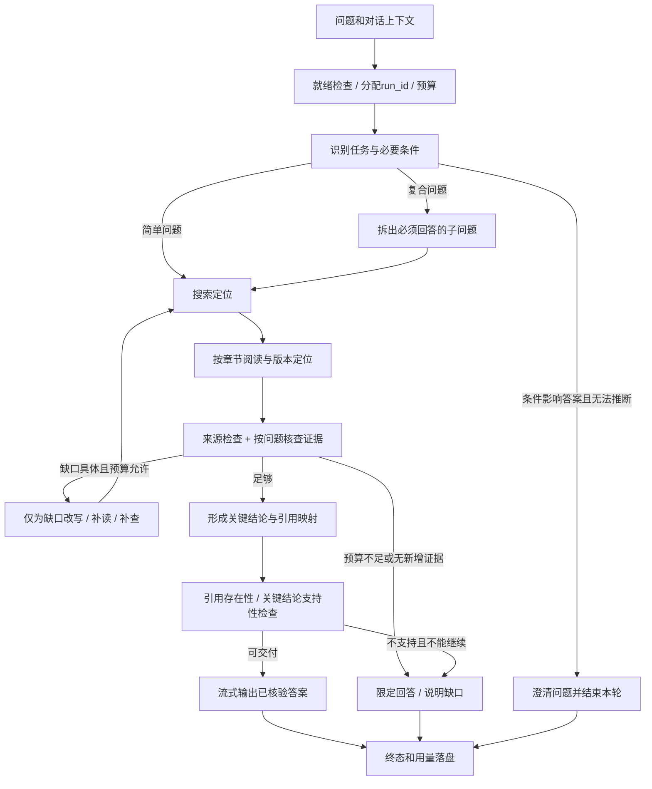

# Agentic RAG：从源码理解到可验证的智能提升计划

> 文档归属：static1。2026-09-16 从 `agentic-rag-static.md` 迁入。本文件是此主题的唯一维护入口。正文中的源码路径以仓库根目录或明确标注的 static1 目录为基准，不以本文目录为基准。


更新：2026-09-16。合并原《Chat LangChain 的 Agentic RAG Pipeline 源码分析》与《LangChain、LangGraph、Deep Agents 与 Agentic RAG Pipeline》，并结合 static1 当前代码制定下一阶段计划。

**文档状态：设计与计划，不表示以下能力已实现。** 原始两份笔记完整保留于 [历史备份](../deprecated/agentic-rag-static-history.md)，旧文件路径保留导航，今后只维护本文。系统现状见 [HLD](../static1_design/HLD.md)、[LLD](../static1_design/LLD.md)、[上游源码映射与 API](../static1_design/API_PIPELINE.md)，实施记录见 [dev_logs](../static1_implement/dev_logs.md)。

## 阅读导航

- 想理解“智能来自哪里”：第1—3节。
- 想知道代码具体改什么：第4—6节。
- 想安排开发、验证和取舍：第7—9节。
- 想控制延迟、token、失败和成本：第6节。
- 查上游原始实现细节：历史备份，不需要每轮重读上游仓库。

## 1. 先定义目标：9分是体验标尺，不是现成测量结果

用户主观评价 chat-langchain 约9分，朴素 RAG 约6分，10分对应文档领域专家或理想的超级智能系统。这个比喻适合作为方向，但不能据此声称 static1 当前已客观达到6分，也不能保证换框架就到9分。朴素检索路线在简单任务上可能非常好，不存在已证明的“6分技术上限”。

专家的价值不只是知道更多：能理解真实需求、发现条件缺失、辨别版本与适用范围、补齐证据、给可执行建议，并知道什么时候应该停下来问人。

建议将体验拆成可检查行为：

| 能力 | 可观察的“智能” | 失败表现 |
|---|---|---|
| 理解任务 | 从追问恢复对象，识别版本、语言、部署条件 | Python和JS混用；回答了另一个问题 |
| 研究策略 | 简单问题短路径，复杂问题分解；按缺口调整查询 | 每题都长篇规划；重复查同一关键词 |
| 阅读能力 | 定位章节并补读前提、代码、例外 | 用摘要当证据；代码被切断 |
| 证据判断 | 把每个关键结论关联到支持材料，识别冲突 | 引用存在但正文不支持结论 |
| 行动建议 | 给适用条件、步骤、最小示例和验证办法 | 泛泛解释，示例无法运行 |
| 自知边界 | 无资料时限定回答或澄清，不制造确定性 | 伪造参数、日期、来源 |
| 效率与体验 | 有阶段进度、可取消、成本可解释 | 卡住、无限补查、token不可见 |

目标不是所有题都研究更久，而是**在同一质量要求下更省，在同一预算下更可靠**。

## 2. 合并后的上游认识与技术分层

### 2.1 chat-langchain 借鉴什么，不照搬什么

根据原始本地源码笔记，上游是应用层 Agentic QA：Managed Deep Agents 提供托管运行入口，官方文档通过远程 MCP 搜索与读取，Pylon 是独立支持知识源，Pricing 和链接检查是独立工具。它的前端展示研究过程、流式答案、会话与取消；身份和线程持久化主要依赖托管能力。

其重要模式是“搜索定位 → 阅读正文 → 继续研究 → 综合与引用”，不是把 top-k 摘要直接交给生成器。上游提示词要求并行查询、先读后答和检查链接，但**提示词要求不等于每次运行均已执行的证明**。

边界需要保留：
- 官方文档 MCP 背后的解析、索引和排序在本地仓库中不可见，不能据此猜测其具体检索算法。
- 原笔记记录的 Pylon 工具是拉取、过滤、选择文章并读取，不应写成已实现向量搜索。
- 上传附件进入当前消息上下文，不等于持久知识库入库。
- 线程持久化、跨线程长期记忆、知识库持久化是三件事；关闭长期记忆不意味着没有线程状态。
- 原笔记里的模型名称、阈值、middleware 参数是当时源码快照，不是 static1 配置建议或当前云端运行保证。
- 私有 Pylon、托管身份和云服务不复制；公开文档正文自行落盘与索引。

因此，借鉴的是研究闭环和工具边界；不能把上游体验优势全部归因于 Agent，也不能忽略它的语料覆盖、模型、文档结构及运行环境。

### 2.2 固定职责，而不是不断换框架

| 层 | static1 中的职责 | 不应该承担的责任 |
|---|---|---|
| LangChain | 模型、消息、工具、结构化输出、适用的middleware | 自动决定所有业务验收标准 |
| LangGraph | 状态、路由、预算检查、有限循环和恢复边界 | 在无收益证据时增加节点 |
| Deep Agents | 局部研究：查什么、读什么、怎样补查 | 无限自主、任意主机访问、替代知识库 |
| SQLite / Chroma / HuggingFace / BM25 | 版本原文、派生向量、混合检索 | 根据相似度直接宣布结论正确 |
| FastAPI / React | 服务状态、请求、事件和用户交互 | 将失败或部分回答伪装成完成 |
| 可选 LangSmith | 调试追踪与实验辅助 | 成为本地运行和评估的必需云依赖 |

LangChain 已提供调用次数限制、重试、摘要等middleware，可优先评估复用；但共享预算和业务停止条件仍需应用层定义，不能认为调用次数限制就等于token预算。[官方 middleware 文档](https://docs.langchain.com/oss/python/langchain/middleware/built-in)

保持 DeepSeek 为默认模型，不因规划引入多供应商。新 API 使用前按实际安装版本做兼容性测试，不直接把最新在线文档示例复制到当前环境。

## 3. 当前 static1 的事实与真正缺口

依据本轮查看的 src/agent/graph.py、config.py、models.py 及现有设计文件：

| 已有事实 | 影响 / 待改进 |
|---|---|
| Deep Agent 可改写查询、搜索后读取，跨研究轮缓存结果 | 已不是纯“一次top-k”系统；尚缺显式问题分解与缺口状态 |
| validate 只检查版本一致与正文非空 | 证明来源有效，不证明相关、完整或支持结论 |
| route 仅在 evidence 为空且未超轮数时补查 | 有一段无关/不充分材料也会进入回答，是优先修复点 |
| 最多6段已读证据，每段60行 | 固定限制可能截断示例，也不能准确限制token |
| research 的 agent.ainvoke 返回报告未被用于状态 | 研究中发现的缺口和结论未形成可靠交接 |
| 搜索记录和已读原文以JSON再次进入研究上下文 | 可复用，但复杂题可能重复传输大量文本 |
| 默认研究步数24、研究轮数2、总超时180秒 | 是流程边界，不是全程token或总模型调用上限 |
| 单次模型 max_tokens=4096，timeout=60，max_retries=1 | 单次输出上限不限制多次调用的累计输入、重试和费用 |
| 可选LangSmith、前端状态与SSE已存在 | 尚无完整本地run账本、阶段耗时、usage汇总与预算决策 |
| 官方公开Python分区已本地导入，可选dense+BM25 | 仍需记录覆盖、缺页、更新时间，不能当作全站或全版本镜像 |

本轮不因为这些缺口直接重写运行代码；先明确验收和实施顺序。

## 4. HLD目标：证据缺口驱动的有界研究

以下图为**目标流程，尚未实现**。简单题可跳过显式规划或语义评审，不为每个框增加一次模型调用。



“智能”落在条件分支里：
1. 不够明确就澄清，而不是默认猜版本。
2. 有证据但不覆盖子问题就补查，不以列表非空结束。
3. 只补具体缺口，不把完整研究重跑一遍。
4. 搜索重复、来源不增加或预算见底就停止，不强迫模型反思直到满意。
5. 冲突先检查时间、语言、产品和版本，不能多数投票消掉差异。
6. 输出区分文档事实、工程建议和未经运行的示例。

首选“一个研究 Agent + 显式状态与检查”。多 Agent 仅在独立子任务确实能提高质量或降低总等待时引入。LangGraph 支持工作流与动态编排，但是否需要并行是本项目的实验决策。[官方工作流文档](https://docs.langchain.com/oss/python/langgraph/workflows-agents)

## 5. LLD计划：把智能变成可以测试的代码契约

### 5.1 建议的渐进模块边界

不先搬空 graph.py。每完成一项能力再抽出职责，保留现有 build_graph 入口和 search/read API兼容层。

| 计划模块（相对static1/src） | 单一职责 | 交付时应覆盖的测试 |
|---|---|---|
| agent/contracts.py | Pydantic任务、证据、判断、预算结构 | 无效source_id、缺字段、枚举、长度与数量限制 |
| agent/telemetry.py | run事件和模型调用账本 | 重试/流结束计数、脱敏、失败终态、重复事件 |
| agent/budget.py | 共享预算预留、结算、取消与停止理由 | 并行预留原子性、超时、usage缺失、写答案预留 |
| agent/planning.py | 任务分类、子问题、澄清策略 | 不必要澄清、追问消解、Python/JS区别 |
| agent/evidence.py | 来源有效性和语义缺口分别判断 | 有材料但不回答问题、冲突、证据过时 |
| agent/context.py | 去重、选择片段和版本绑定摘要 | 长代码不被粗暴截断、失效摘要不复用 |
| evaluate.py及测试数据 | 固定问题集、评分和A/B报告 | 指标分母、缺失结果、失败不可静默剔除 |

### 5.2 状态设计：不再只有 messages / evidence / rounds

建议逐步添加：
- TaskSpec：question、resolved_context、product、language、version_constraint、required_subquestions、needs_clarification。未知版本显式为空，不让模型补造。
- EvidenceItem：evidence_id、doc_id、version、page、start_line、end_line、section_path、text、source_url、captured_at。
- ClaimAssessment：claim_id、subquestion_id、supporting_evidence_ids、status（supported / partial / unsupported / conflicting）、gap、suggested_action。
- ResearchResult：assessments、unresolved_questions、new_evidence_ids、stop_reason。让研究输出真正进入外层状态，不再丢弃报告。
- RunBudget：deadline、token_limit、reserved_tokens、observed_tokens、model_calls、tool_calls、answer_reserve、usage_quality。
- RunOutcome：completed / partial / needs_clarification / cancelled / timed_out / failed，以及可展示的reason_code。

结构化输出只保证形状可解析，不保证事实正确；先用Pydantic检查，再检查证据ID和正文定位，最后才对必要结论作语义核验。不要把模型自己给的0.95置信度直接当作上线条件。LangChain 有结构化输出机制，但具体策略仍取决于模型和接口兼容性。[官方结构化输出文档](https://docs.langchain.com/oss/python/langchain/structured-output)

### 5.3 替换路由条件，而不是增加一句“请认真检查”

目标路由伪代码：

```text
if cancelled or deadline_exceeded:
    finalize_with_explicit_status
elif needs_clarification:
    ask_one_material_question
elif all_required_claims_supported:
    answer
elif has_actionable_gap and has_budget and made_progress:
    research_only_missing_subquestions
else:
    answer_supported_parts_and_list_gaps
```

首次缺口即使尚无新证据，也允许一次有针对性的修复；“made_progress”用于后续重复循环，不能让第一次空搜索直接失去改写机会。信息增益先用“新增有效片段、补齐子问题、解决冲突”等可记录代理指标，不声称精确计算信息论收益。

语义核验不是每题加一个昂贵Judge：先检查对象、语言、版本、关键字段和引用有效性；仅复杂或风险较高的结论进入小范围评审。评审失败保留为unknown或partial，不默认为通过。

### 5.4 检索与阅读：优先更新结构，不急着换向量模型

顺序建议：
1. 保留标题层级、产品、语言、文档版本及更新时间；区别抓取时间与文档发布日期。
2. 搜索返回定位、章节和短摘要；阅读按标题扩展上下文，保持完整代码块和参数说明。
3. 将查询改写限定在原问题范围，保留API精确词；按子问题检索并去重。
4. 测试无embedding的BM25、dense、hybrid三组，找出真正漏召回的题。
5. 只有“候选已有正确段落但排名错误”的案例占比明显时再试reranker；不靠增加top-k无界扩大上下文。
6. 同一文档多片段占满预算时做多样性限制，但不能误删解释同一复杂API的必要段落。

缓存键必须含语料版本或generation、过滤条件、检索参数和模型签名；跨请求缓存不能只按查询字符串。原文是事实来源，摘要必须绑定版本和证据ID，可随时回读。

### 5.5 回答核验与流式体验的取舍

已经发给用户的token不能真正撤回。优先先形成简短“关键结论—证据”结构并核验，再流式表达；代码/API高风险题可缓冲完整草稿核验后输出，代价是正文首token更晚。

普通解释题可核验关键结论后流式输出，并做终态检查；若发现问题必须显示更正/未验证状态，不静默标为成功。前端分别显示“正在研究”和“正文首token”，不能用心跳掩盖真实延迟。

代码校验先语法、导入、版本API与小型离线示例；真正运行必须在隔离、受限、默认无网络环境中。文档里的shell指令不自动执行，不能让“专家能力”变成宿主机任意执行权限。

## 6. 响应、token和协调：先有账，再谈优化

### 6.1 每次运行的最小账本（计划）

本地独立运行日志库或JSONL，不把临时事件塞进知识库docs表。推荐记录：
- run_id、父子span_id、实验版本、模型配置摘要、语料manifest哈希、开始/结束时间、终态；
- 排队、检索、读取、模型、核验、正文首token和总耗时；
- 每次实际模型调用/重试的input/output/total tokens，缓存或推理token在提供方有报告时分列；
- usage来源（provider / estimated / unknown）；缺失是unknown，不是0；
- 搜索/阅读次数、cache hit、新增证据数、重复查询、补查原因、停止理由；
- 错误类别和预算变化，默认不记录密钥或完整敏感正文，详细trace显式启用并设保留期。

流式usage可能只在末尾返回，取消、网络中断时可能拿不到最终账单。按调用ID聚合，不能把每个chunk累计值再次求和；内部重试和Deep Agent内部调用也必须纳入账本，避免只统计最终答案。提供方账单与应用估算分开。LangChain 模型接口描述了usage metadata和流式usage，但OpenAI兼容地址不保证所有扩展字段一致，DeepSeek需做实际契约测试。[官方模型文档](https://docs.langchain.com/oss/python/langchain/models)

不写死在线价格。若显示费用，用可配置价格表、币种、单位和生效日期；价格或usage未知时显示“未知/估算”，不能伪报实际费用。

### 6.2 预算策略草案，不是当前保证

先测基线，再调以下**实验初值**：

| 档位 | 用途 | 总输入+输出token软预算 | 模型调用上限 | 搜索/阅读上限 | 总时间预算 |
|---|---|---:|---:|---:|---:|
| 快速 | 单API、单事实 | 12k | 4 | 2 / 3 | 45秒 |
| 标准 | 比较、常规排障 | 30k | 8 | 4 / 6 | 90秒 |
| 深入（显式选择） | 多条件、多文档 | 60k | 12 | 8 / 10 | 180秒 |

这些值未经当前机器和模型实测，不作为性能承诺。每次重复输入都计入累计token。默认先保留现有模式，以功能开关启用新预算，避免直接造成已可回答问题退化。

控制规则：
1. 调用前估算输入并预留输出；研究不得占用最后的答案预留，建议初值为总预算20%，需实测。
2. 已报告usage用于结算；估算偏差、供应商内部行为意味着不能承诺精确账单硬封顶。
3. 硬边界是：调度器不再启动超预算的新调用、每次输出上限、工具次数、总deadline；已在途请求取消后仍可能计费。
4. 重试共用同一预算和deadline；SDK与middleware只选一层作为主要重试控制，防止乘法放大。仅短暂网络/限流错误有限重试；参数错、缺密钥、空检索不能盲重试。
5. 默认一个前台活跃问答；并行只给彼此独立的只读任务，初值最多2个，预算原子预留并收敛取消。
6. 索引构建和在线问答争CPU/GPU时提供队列/状态，优先保持健康接口与取消可响应；embedding离线成本另记，不混入模型token。
7. 终态只写一次；断连、取消、超时和失败保留已知usage，不把未完成运行算成成功。

LangChain调用限制middleware可以作内层保护，外层budget是全run权威账本；不能让外层图和各Agent分别认为自己还有一整份预算。

### 6.3 前端与API演进（拟议，不是现有接口）

保留现有POST /api/chat及status/sources/token/error/done事件。增量增加run_id、stage、usage、budget、stop_reason；用schema_version兼容旧客户端，先客户端兼容，再后端发送新事件。

计划新增本地运行摘要查询及取消接口时，明确run所有权（个人版仍限定本进程）、404/409行为、幂等取消、终态及重启语义。不要先宣称刷新可恢复流：恢复需要事件持久化、序号和重放契约，放到后续里程碑。

页面展示阶段耗时、已读来源、补查原因和用量估算；展示简洁决策摘要，不记录或展示模型私有思维链。

## 7. 如何验证：把“感觉更聪明”变成可复现证据

### 7.1 建议建立 docs_expert_v1

初始60题，10类各6题：单事实/API、带约束代码、跨页比较、排障、版本冲突、多轮追问、条件不明需澄清、知识库缺失、中文问英文API、文档提示注入。每类4题开发、2题保留，共40开发/20留出；同一知识点的近义题放同一侧，避免泄漏。

每题包含question/history、产品/语言/版本、预期关键结论、支持文档和版本定位、允许的澄清/限定回答、禁止编造项。先人工核对来源，再运行模型；题集建设不能只让当前系统生成自己的标准答案。保留原retrieval_v4用于原领域回归，不用其8题满分代表官方文档专家水平。

语料manifest记录来源、版本、抓取时间、缺页、embedding配置。缺失文档的题仍保留，但按“缺失时处理是否正确”评分，不能从分母移除。

### 7.2 对照矩阵与消融

- A：固定一次检索+生成的朴素基线。
- B：当前static1单Agent版本。
- C：B + 结构化缺口路由。
- D：C + 有选择的证据/答案核验。
- E：仅在有证据时加入上下文优化、重排或并行。

A—E尽量同DeepSeek配置、相同语料快照、同预算档位。一次只改一个因素，记录prompt/code/dependency/config版本。简单题看能否缩短路径，复杂题看是否真正补齐遗漏，而不是只比较答案长度。

chat-langchain网页端是外部体验参照：使用同题、相同会话前提、记录日期、来源和完整结果，由用户执行；其模型、私有语料、成本不可控，不将它与本地差异归因为某一个代码改动，也不虚构它的token消耗。

### 7.3 评分与发布门槛

质量评分（初拟权重）：关键结论正确30%、问题覆盖20%、证据支持20%、可执行性15%、不确定性处理10%、对话理解5%。每维0—4分，用评分锚点说明扣分，换算体验分仅用于内部比较，不把“9分”解释为领域专家等价性。

同时单独报告：有效引用率、关键结论证据支持率、可运行示例通过率、应澄清命中/不必要澄清率、缺失题安全回答率、失败率、p50/p95正文首token和总延迟、累计token、每个合格答案的消耗。拒绝所有问题不能获得高分；超时与失败保留在统计中。

先确定性检查引用、版本、结构和代码；再由人工按rubric盲评，模型Judge只作辅助，抽查其判断偏差。边界与冲突题必须人工核对。每个候选至少3次重复，报告波动、逐题胜平负；20道留出题只能作小样本门禁，p95不作稳定SLA证明。

建议初始晋级条件（待基线校准）：
- 定向缺口题的关键结论覆盖率相对B提高至少10个百分点，且没有新增严重编造/注入成功案例。
- 简单题质量不降；普通档p95延迟和token各不超过B的1.2倍，否则只给复杂题开启。
- 确定性来源定位检查在本次发布样本全部通过；答案语义支持仍单列人工结果。
- 若只增加token、节点或“思考感”而无质量收益，关闭功能并记录负结果。

## 8. 下一阶段计划：按可验收的小步交付

| 顺序 | 类型 | 具体交付 | 验收 / 停止条件 |
|---|---|---|---|
| P0a | 补充 | run_id、调用账本、阶段耗时、失败终态；不改变推理路径 | 替身测试覆盖重试/取消/缺usage；真实小样本核对供应商usage字段 |
| P0b | 补充 | docs_expert_v1题集、语料manifest、A/B基线报告 | 每题有人工核对证据；质量/延迟/token分开出报告 |
| P1 | 更新 | ResearchResult结构与缺口路由，替换“非空即足够”；只补缺口 | 有相关但不充分材料仍补查；重复循环可停止；留出集通过 |
| P2 | 优化 | 章节阅读、完整代码、去重、语料版本缓存、按需核验 | 漏召回/截断案例改善；引用和API版本不退化 |
| P3 | 更新 | 共享预算与快/标准/深入策略，前端阶段和用量展示 | 并行预留无超发；取消不启动新调用；简单题更快或更省 |
| P4 | 补充 | 可选持久会话、版本绑定摘要、故障恢复契约 | 追问正确、摘要可追溯、重启行为清楚；不是默认长期记忆 |
| P5 | 条件实验 | 只读任务并行 / reranker / 多模型或多Agent之一 | 单项消融显示质量或等待收益，并满足共同预算；否则撤回 |

最先实现 P0a + 小型人工核对题集，再扩完整P0b并进入P1。不要等监控面板完善才修复路由，也不要先启动P5。时间估算要等P0测出CPU索引和模型响应瓶颈后再排，不把未知工作量写成承诺日期。

每项交付同步：代码/测试、HLD或LLD涉及条目、Strata状态、dev_logs的【任务】【实现情况】【分析、评价】【验证】。设计图只在状态或模块关系改变时更新，不为每个辅助函数画图。

## 9. 做减法与发布稳定性

- 删除重复研究报告和无用工具返回字段；保留定位与必要正文，不重复塞全量搜索JSON。
- 不叠加多个规划器、Judge或重试层；便宜的确定性检查能解决就不调用模型。
- 不为“看起来智能”默认开放shell、任意网页和文件访问。新增工具先列实际权限、数据边界与失败契约。
- 不静默从embedding切BM25；若实现降级，页面和run记录模式与原因，单独评估效果。
- 新路由、评审、预算分别设开关，保留当前路径作为回退；schema采用增量迁移，日志库与知识库隔离。
- 先离线替身、再小样本真实调用、再留出集和用户前端对照。涉及付费模型预算先明确；不会因本计划自动执行大量付费测试。
- 发现延迟来自索引/读取就修数据路径，不用更强模型掩盖；发现证据有而组织差才优化研究与写作。
- 达到当前门槛就结束本轮，不把“10分专家”变成无限开发目标。

## 10. 本轮结论与资料边界

**建议的下一步不是“再加一个Agent”，而是先建立运行账本和评估尺子，再把当前基于证据是否为空的路由，改为基于问题覆盖与证据缺口的路由。**

这将“智能”变成可以定位、测试和回退的代码行为：理解条件、选择下一步、核对支持、节制消耗、说明未知。框架提供机制，语料和评估决定边界，用户体验验证最终价值。

资料核对日期：2026-09-16。上游具体文件与历史配置见完整备份和API_PIPELINE；本轮不重新推断其云端实现。在线资料仅用于核对LangChain/LangGraph已有机制，项目路线与阈值为本文设计建议，不是官方推荐或已测结论。

## 11. 2026-09-16 实践反馈后的执行 pipeline

### 本次代码执行批次：隔离、研究交接与停止路由

目标：前端请求仅由生效版本构造，后端拒绝传入旧证据/旧研究状态；新增结构化研究交接，按子问题缺口有限补查；本地核验确实缺页且当前运行没有补页能力时硬停止。非目标：自动联网补页、更换检索模型、加入reranker、完整usage账本或声称质量评测已通过。

硬约束：重新生成只发送此前生效的user/assistant纯文本消息与当前问题；历史版本、来源面板和研究结果不进入请求。服务端每次新建evidence/searches/rounds等状态，不从客户端恢复研究状态。

硬约束：单次搜索无结果不等于缺页。只有空目录，或对用户/已读正文中确实出现的官方页面URL做本地目录核验后确认不存在，才能标记corpus_missing。当前问答为local-only、无自动补页工具，确认缺页后输出“未能补齐/unknown”和一个材料补充动作，终止后续搜索/读取及外层循环。无依据的缺页报告只能为unknown。

验收：非空但部分覆盖仍定向补查；无进展、搜索/阅读预算或轮数用尽停止；非法证据引用不能提升为supported；硬停止后不再启动知识库搜索/读取；请求隔离和新旧路径开关有离线回归。通过确定性测试后记录实现状态，真实模型效果另行验收。

本节细化第8节实施顺序，不建立第二份规划。**已完成答案操作与浏览器计时，并完成本批次的上下文隔离、结构化研究报告、缺口路由、目录核验硬停止及回答提示词调整。** 第3节保留改造前基线，不代表新的路由现状。完整题集质量评估、章节阅读、usage账本、步骤历史、来源去重仍未完成；不能把离线流程通过等同于答案质量达标。

### 11.1 本次交付的边界与口径

- 复制原始答案Markdown，保留代码围栏和引用编号，不拼入耗时、按钮、旧版本或来源面板。停止/失败后的已有正文也可复制；流式生成中暂禁用。剪贴板拒绝时明确提示手动复制。
- 最新一轮重新生成：从此前生效完整版本重建消息，不信任旧requestMessages快照，不包含被替换的答案；旧答案、来源、耗时和状态保留在“之前的回答”。新版本独立计时，不清空输入框草稿。后续提问只使用各轮最新且完整的答案，旧版本不自动回填上下文。暂不支持早期轮次重生成分支。
- 首 token / Think 等待：浏览器单调时钟从发起请求计到第一段非空正文；状态、来源和空文本不触发。包含检索、阅读、模型和网络，不是模型内部推理时间，也不是提供商侧严格的单token生成延迟。
- 总时间：同一起点到成功done到达浏览器，含正文前等待和正文输出；接收done即结束消费，不额外等待连接关闭。运行中刷新，结束后固定。
- 停止/失败记录已耗时，成功总时间保持null；未收到正文时首token保持null。导出保留各版本数据，对话仍仅存当前页面。
- 本轮不修改模型、检索、回答提示词或后端SSE字段。前端已重新构建；真实模型速度和答案质量未评测。

### 11.2 文档支持与业务策略分开

文档描述架构可组合，不推导出“某个组件必需加入”。是否添加改写、验证、重排或额外Agent，由本地失败证据与对照结果决定。以下是本项目业务策略，不表述为LangChain官方强制规范：

1. 普通问答先回答有支持的部分；不足之处用一句范围说明加1—3项可执行排查动作收口。每项说明检查什么，以及不同结果对应的下一步。不重复罗列“证据没有提到”。
2. 若缺失版本、配置或样例会改变结论，提出一个关键澄清问题；不强迫输出无依据的操作建议。
3. 明确要求审计时，允许逐项列出支持、反证、未验证及引用；审计风格不作为普通咨询默认输出。
4. 允许由已核实事实形成有条件的工程建议，但标明前提；不能用“建议/推断”标签包装未核实的API、模型能力或性能承诺。
5. 区分“事实错误”“当前材料无法验证”“正确但不适用”“材料支持但没有回答问题”。某标题下没有列出某组件，不能证明该架构排斥它。

### 11.3 研究到交付的执行顺序（基础路由已实现，完整评估待做）

| 步骤 | 输入 / 动作 | 输出 / 转移条件 |
|---|---|---|
| 1. 固定基线 | 固定问题、历史、模型配置、代码版本和语料manifest，保留原路径结果 | 可配对的质量与性能样本；记录失败，不筛掉难题 |
| 2. 理解任务 | 恢复追问对象，识别咨询或审计，拆出必须回答的子问题 | required_subquestions、answer_mode、material_unknowns；简单题不另加规划调用 |
| 3. 搜索与阅读 | 按子问题搜索，保留候选及阅读范围，核对版本和正文 | 带doc_id/version/行号的证据，标明截断与可续读位置 |
| 4. 覆盖与缺口判定 | 子问题关联证据，分别检查相关、完整、冲突与来源有效性 | supported / partial / unsupported / conflicting；缺口类型、依据和下一动作。未知不强行归因 |
| 5. 最小修复 | 按11.4选择补查、补读或表达修复，统一检查轮数、时间和进展 | 针对性修复后再评估；重复查询、无新增覆盖或预算耗尽则停止 |
| 6. 研究交接 | 研究结果显式返回外层，不再丢弃发现与缺口 | 子问题判断、证据ID、未解决项、停止理由；报告不是新的事实来源 |
| 7. 组织与检查答案 | 先结论，再必要依据与行动；普通不足题执行11.2，审计另用逐项结构 | 引用存在、API/代码依据及结论范围检查；不为每题固定增加Judge调用 |
| 8. 完成与评估 | 记录完成/部分回答/澄清/取消/失败及观测质量 | 分开评价事实、证据、问题覆盖、可执行性和成本；满足门槛才替换旧路径 |

先增量承接研究结果与覆盖状态，再替换外层“证据非空即回答”的路由，不一次性重写全图。新路由以功能开关保留旧路径。对确定缺失的语料，不让模型无限改写查询。

本批次落点：第2—7步由同一个研究Agent通过finish_research交接，不增加独立规划器或Judge；evidence.py验证结构/证据ID并做确定性路由。子问题拆解、语义支持判断和普通/审计模式识别仍由模型完成，不能宣称独立核实。未提交有效报告时停止为handoff_missing，不把已有证据自动视为充分；补查不能删除之前识别出的未解决子问题。EVIDENCE_ROUTING=false可切回原非空证据路由，新路径默认开启，但真实模型质量门槛尚未验收。

### 11.4 缺口分类决定动作

| 缺口 | 支持该判断的观察 | 最小动作 | 不应自动做的事 |
|---|---|---|---|
| 语料缺失 | manifest/原文核查确认目标页面未入库；例如integrations不在自动导入范围 | 在授权范围补充公开文档，或说明缺资料并给补充路径 | 加reranker、无限重搜 |
| 召回缺失 | 已知正确正文在库，但当前候选未出现 | 保留精确实体/API词，改写一次或检查切分与过滤 | 宣布需要更多Agent |
| 排名问题 | 候选已有正确证据，但排序使其未被选读 | 调整候选选择，以离线对照判断是否试重排 | 没有候选证据就先换模型 |
| 阅读不完整 | 命中正确页面，但代码/前提在窗口外 | 续读或按章节扩展，合并重叠片段 | 让答案模型猜被截断代码 |
| 覆盖/交接遗漏 | 只覆盖部分子问题，或研究结果没有交接 | 只补缺口，保存ResearchResult | 完整重跑所有研究 |
| 输出策略问题 | 已读证据足够，但输出遗漏、过度审计或重复拒绝 | 修复回答组织及任务模式 | 增加检索轮数或默认添加验证Agent |
| 事实冲突/条件缺失 | 来源版本或范围冲突，用户条件不足 | 查清版本/适用前提，必要时澄清 | 多数投票、主观选结论 |
| 未知 | 只有“没搜到”，无法区分缺页与召回失败 | 标记unknown，做一次有范围诊断或请求关键输入 | 将猜测写为根因 |

### 11.5 usage不完整时的数据契约（待实现）

每项指标独立保存 `value: number | null`、`source: provider | client | estimated | unknown`、`completeness: complete | partial | missing`；整轮另记可观察模型调用数量与有usage的调用数量。已知部分之和只显示为“已报告部分”，不冒充全程总量。SDK内部不可观察重试的用量明确记为未知。

- UI用“未报告”表示missing，估算显式标注，不能补零。提供商明确报告的0保留为0。
- 输入总量、输出总量、缓存命中输入分别记录；缓存命中是输入子集，不重复相加。缓存字段缺失不自动使完整的输入/输出失效，缺失状态按字段保存。
- unknown不进入均值、分位数、差值或收益判断；partial和estimated不能与完整provider实测混算。
- A/B数值比较仅使用该指标双方口径一致且完整的配对样本，同时报告总样本数、有效配对数、missing/partial比例和排除原因。样本不足或缺失分布明显不同时，结论为“证据不足”，不能宣布优化成功。
- 被排除的用量记录仍参加质量、失败率、取消率及统计完整率报告。不可因为失败没有usage就把失败运行从总体删除。
- 模型上下文缓存与本地检索缓存分列；本次浏览器耗时不标为provider观测。

### 11.6 小步验收与停止条件

本次交互验收：复制原始Markdown；重新生成不带旧答案且保留版本；首字忽略状态/空片段；完成计时固定；取消/失败不生成成功总时间；导出保留null；桌面/移动端可操作。替身流验证契约，不代表真实模型速度或质量提升。

下一批最小样例：本次“hybrid retrieval还是LangGraph”原题、已入库但漏召回、候选正确但排序靠后、代码跨窗口、证据充分却长拒绝、确实缺页、明确要求审核、usage缺失与中断。各样例需人工核对事实与材料，不把chat-langchain或static1互评直接当标准答案。

晋级先看行为：缺口归因有依据；补查只针对缺项；没有排他绑定架构；普通不足回答不写长篇拒绝；不补造API；审计仍可详细；unknown不参与成本收益计算。再按第7节评估质量与延迟，不承诺固定12秒或相同token。若只是输出更短但事实/覆盖退化，不能晋级。
