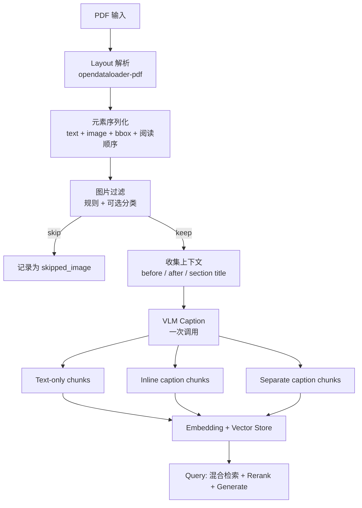

# 图片 RAG Pipeline 蓝图

> 工作目录：`rag_pdfs`  
> **实验性**：PDF 解析与图片 ingest 仍在迭代，模块以 `pdf_*` 前缀隔离。  
> 当前实现：`ingest_img.py`（canonical ingest CLI）+ `query_img.py`（canonical query CLI）+ `pdf_parser` / `pdf_filter` / `pdf_layout`  
> 参考经验：`notes.md`（博客结论 + 实验设计）  
> 运行记录：**[`logs.md`](logs.md)**

---

## 0. 模块结构（2026-06-06 重构）

| 模块 | 作用 |
|------|------|
| `ingest_img.py` | canonical ingest CLI：编排 parse → filter → caption → chunk → Chroma |
| `pdf_layout.py` | Layout 元素模型、阅读顺序、section title、上下文提取 |
| `pdf_parser.py` | opendataloader-pdf 调用、flatten、图片路径解析 |
| `pdf_filter.py` | L1/L2 图片规则过滤（VLM 之前） |
| `caption_chunks.py` | inline / separate chunk 构建（通用 RAG ingest，无 `pdf_` 前缀） |
| `hybrid_retrieve.py` | BM25 + 向量余弦混合检索 |
| `query_img.py` | canonical query CLI（实验组 A/B/C + hybrid/vector 检索） |
| `eval_img.py` | LangChain 批量实验 CLI（策略 × 检索模式 × alpha，对比 evidence 指标） |

PDF 相关逻辑集中在 `pdf_*`，便于日后替换 parser 或单独废弃实验路径。

---

## 0.1 当前产品优先级：解析到图文 Markdown Tool

`agent_rag_growth_roadmap.md` 将本仓库定位为 Agentic RAG 产品原型。为了让后续 caption、chunk、检索和评估更稳，当前先把解析工具层作为前置优先级：

```text
source data / webpage snapshot
-> PDF
-> opendataloader layout JSON + extracted images
-> elements.jsonl / images.jsonl
-> image-aware Markdown
-> rag_pdfs ingest / caption / chunk / eval
```

目标不是马上改 query 端，而是先形成一个人能检查的中间产物：Markdown 中的文本、图片位置、页码、bbox、相对图片路径都清楚。这样阅读顺序、图片漏抽、图文错位等问题可以在 VLM caption 之前发现。

当前工具入口在 `parsers/redox_opendataloaderpdf.py`；稳定后再决定是否把 Markdown 导出能力下沉到 `rag_pdfs.pdf_parser` 或保留在 `parsers/redox_*` 工具箱。

最小完成标准：

- 单个 PDF 可输出 layout JSON、`elements.jsonl`、`images.jsonl`、`parse_summary.json` 和 `document.md`。
- `document.md` 使用相对图片路径，并在图片附近保留 page / bbox / image source。
- 输出目录遵循 `outputs/<source-stem>/opendataloader_pdf/` 或显式 `--out`。
- `rag_pdfs.ingest_img --help` 仍可运行；行为变化需追加 `logs.md`。

### 0.2 网页采集前置层（2026-07-16）

`parsers/rewebpage_{craw,firecrawl,scrapling}.py` 已统一为 Layer 0 页面快照接口：

- 单 URL 直接输出到 `<source-dir>/<tool>/page.*`，不再增加 slug 层；
- `page.json` 统一 `snapshot` 字段，provider 原始数据保留在 `raw`；
- crawl4ai / Firecrawl 可产 `page.pdf` 作为视觉保真路径，Scrapling 提供轻量 HTTP/JS/stealthy 文字通道；
- RAG 主文字路径仍应消费 `page.md`，待 `markdown -> 元素流` adapter 落地；Firecrawl
  截图 PDF 常成为整页图片，crawl4ai 原生打印 PDF 则可能保留文字层（本次 smoke 为 3 文本/0 图片），
  两者均需检查 `parse_summary.json` 后再决定用途。

实现与验证细节见 [`../parsers/rewebpage_notes.md`](../parsers/rewebpage_notes.md)。

### 0.3 MinerU 纯 CPU 备选解析器（2026-07-16）

`parsers/redox_mineru.py` 已把 MinerU 3.4.x 的 `pipeline` 后端接入同类解析包：保留
`raw/`，并从官方 Markdown / content list 生成 `document.md`、`elements.jsonl`、
`images.jsonl` 和 `parse_summary.json`。`static_structurer --tool mineru` 可写顶层 manifest；
PDF 默认仍是更轻的 opendataloader。

本机无 GPU 首-page smoke 通过（23 元素、4 图像/图表、缓存后约 20.8 秒），证明 CPU
路径可用；这只是 parser 质量交叉验证，不改变 caption 只在 ingest 发生、query 只读文本
的主原则。实现和完整运行记录见 [`../parsers/redox_notes.md`](../parsers/redox_notes.md)。

---

## 1. 问题定义

### 1.1 核心挑战

技术文档 PDF 中的图片往往承载关键信息（截图路径、表格数值、架构图标签），但传统 text-only RAG 在 ingest 时丢弃了图片，导致：

- **Image helpful** 问题：答案模糊，缺少可操作性（"设置在哪？"）
- **Image required** 问题：直接答错或漏答（表格里的 retention 天数）

### 1.2 第一性原理结论（来自 notes.md）

```
Vision at ingestion, text at retrieval.
```

| 阶段 | 做法 | 原因 |
|------|------|------|
| Ingest | VLM 读图一次 → 生成 caption → 当文本索引 | 一次性成本，可缓存 |
| Query | 只检索文本 chunk + caption chunk | 避免多模态 query 的 token 膨胀和 payload 限制 |

**不是**：query 时把召回的图片再发给 VLM。  
**而是**：把图片预先"读"成可检索、可引用的文本证据。

### 1.3 图片的两类价值（用于评估标注，不是 ingest 分支）

| 类型 | 含义 | Caption 侧重点 |
|------|------|----------------|
| **illustrative** | 辅助理解操作步骤 | UI 路径、按钮位置、菜单层级 |
| **load-bearing** | 答案本身在图里 | 表格行列值、矩阵、图示标签、架构组件名 |

这是**评估维度**（gold label 的 `image_role`），不建议在 ingest 主流程里硬分叉成两条 pipeline；更合理的是：**统一 caption prompt，按图类型自适应转录细节**。

---

## 2. 现有工程上下文

### 2.1 目录资产

| 文件 | 状态 | 作用 |
|------|------|------|
| `notes.md` | 完整 | 博客经验、A/B/C 实验设计、指标 |
| `ingest_img.py` | 可运行 | canonical ingest CLI：PDF → caption → chunk → JSONL/Chroma |
| `pdf_layout.py` | 实验性 | Layout 元素、阅读顺序、上下文 |
| `pdf_parser.py` | 实验性 | opendataloader-pdf 解析 |
| `pdf_filter.py` | 实验性 | L1/L2 图片过滤 |
| `caption_chunks.py` | 可用 | inline / separate chunk 构建 |
| `hybrid_retrieve.py` | 可用 | BM25 + 向量余弦混合检索 |
| `query_img.py` | 可用 | canonical query CLI（A/B/C 策略 + hybrid/vector） |
| `eval_img.py` | 可用 | 批量跑问题集，输出 per-run JSONL 与 summary |
| `embeddings.py` | 留在 `rag_langchain/` | 本地 Qwen3 embedding 探索（主线用 `ingest_img.build_embeddings`） |
| `chunkings.py` | 留在 `rag_langchain/` | 自研 recursive/semantic chunking（ingest 未复用） |
| `a1_vector_store.py` | 留在 `rag_langchain/` | Chroma 基础用法示例 |
| `chats.py` | 留在 `rag_langchain/` | DeepSeek LLM 初始化示例 |
| `pdf_parsers.ipynb` | 留在 `rag_langchain/` | opendataloader-pdf 试验 |
| `core/indexing_img.py` | 空文件 | 占位，非入口；主入口是 `rag_pdfs.ingest_img` |

> **2026-06-10 起 `rag_pdfs/` 为 canonical 包**（自包含：ingest / query / eval / hybrid / pdf_* / caption_chunks）；`rag_langchain/` 保留为历史探索材料，不再维护。

### 2.2 `ingest_img.py` 已实现的能力

```
PDF (opendataloader-pdf)
  → layout JSON + 外链 PNG
  → flatten 为 LayoutElement 序列
  → 小图 bbox 过滤
  → VLM caption（带 before/after 上下文）
  → 生成 4 种 chunk 产物 + image_captions.jsonl
  → 可选写入 4 个 Chroma collection
```

产物对照 notes.md 实验组：

| 产物 | 对应实验组 | 说明 |
|------|-----------|------|
| `text_only_chunks.jsonl` | A: Text-only baseline | 纯文本，不插 caption |
| `inline_caption_chunks.jsonl` | B: Inline caption | caption 插回阅读顺序 |
| `separate_caption_chunks.jsonl` | C 的一部分 | 每张图独立 chunk |
| `separate_mixed_chunks.jsonl` | C: Separate caption chunks | text + image_caption 混合索引 |
| `--no-caption-context` | D: Separate without context | 消融：caption 不给上下文 |

### 2.3 依赖与运行前提

- Java 11+（opendataloader-pdf）
- DashScope API key（默认 VLM caption：`qwen-vl-max`）；DeepSeek API key 用于 query answer LLM
- 本地 embedding 模型路径（`QWEN3_EMBEDDING_06B_PATH`）
- Ingest 入口：`uv run -m rag_pdfs.ingest_img`
- Query 入口：`uv run -m rag_pdfs.query_img`

常用命令：

```bash
# ingest
uv run -m rag_pdfs.ingest_img tmp/raws/foo.pdf --out tmp/outs/foo --build-chroma

# query
uv run -m rag_pdfs.query_img --index tmp/outs/foo --strategy separate --show-evidence "question"
```

---

## 3. 评审 `ingest_img.py` 注释中的 Pipeline 思路

你在文件头注释的 pipeline：

```
parse → extract → describe → filter → caption → inline/separate → embed → rag → retrieve
```

### 3.1 需要修正的理解

#### ❌ "describe the image [this image used for what?]" 不应作为独立 VLM 步骤

你把 **describe** 和 **caption** 拆成了两步，并问 describe 能否去掉。

**结论：可以去掉独立的 describe 步骤。** 原因：

1. 对 RAG 而言，caption **就是** describe——一段面向检索和 grounding 的文字转写。
2. notes.md 里的 "判断图片类型（screenshot/table/logo）" 属于 **filter/classify**，不是另一次全文描述。
3. 若先做 describe 再做 caption，等于 **两次 VLM 调用**，成本翻倍，且信息高度重叠。

**推荐合并为：**

```
filter（规则 + 可选轻量分类）→ caption（一次 VLM，prompt 已含 surrounding text）
```

#### ✅ filter 在 caption 之前——正确

过滤的目的：不对 logo、装饰图、过小图、极端长宽比、不支持格式做昂贵 VLM 调用。

当前实现已包含 bbox 面积、小图长宽比、页边小图、噪声关键词、稀疏上下文等 L1/L2 规则；下一步重点是用标注集验证误伤率。

#### ✅ inline vs separate 两套 chunk——正确

与 notes.md 方案 A/B 完全对齐。当前实现已能产出对比实验所需的全部 JSONL。

#### ⚠️ "describe 的结果就是 caption"——基本正确，但要区分两种"描述"

| 描述类型 | 目的 | 是否进索引 |
|----------|------|-----------|
| 分类标签（logo / table / screenshot） | 决定是否 caption、选择 prompt 变体 | 不进索引，只写 metadata |
| Caption 文本 | 检索 + answer grounding | **进索引** |

不要把分类标签和 caption 混为一个步骤；分类应尽量便宜（规则优先，必要时一次简短 VLM 调用）。

#### ⚠️ illustrative vs load-bearing 不应做成 ingest 硬分支

这是**问题标注维度**（评估时标注 gold evidence），不是 ingest 时必须预判的分流。

实践中：统一 caption prompt 已要求转录 UI 标签、表格值、图示节点——VLM 会按图内容自适应。若后续要优化，可在 caption prompt 里根据分类标签切换 **emphasis**，而非走两条 pipeline。

### 3.2 修正后的 Pipeline（推荐）



---

## 4. 完整 Pipeline 分阶段设计

### Phase 0：解析与元素模型（当前 ~80%）

**目标**：从 PDF 得到有序的元素流，每张图带足 metadata。

**已有**：
- `opendataloader-pdf` → JSON + PNG
- `flatten_layout` → `LayoutElement` 列表
- `nearby_context` → before/after 文本

**待完善**：

| 项 | 优先级 | 说明 |
|----|--------|------|
| 阅读顺序可靠性 | P1 | 验证 flatten 遍历顺序是否与页面视觉顺序一致；必要时按 `(page, bbox.y, bbox.x)` 重排 |
| Section title 注入 | ✅ | caption prompt 已注入 section title；无 heading 页兜底启发式已加（同页首个 ≤80 字符短文本当伪标题，2026-06-10，HermesX 锚点 1/8 → 9/9） |
| 表格元素处理 | P2 | 当前 `TEXT_TYPES` 含 `table cell`，但未结构化；load-bearing 表格可能在 text 流里已有部分信息，避免 caption 与 text chunk 重复 |
| 多 PDF / doc_id | P2 | 当前按单 PDF 设计；批量 ingest 需要 `doc_id` 字段 |
| 模块命名统一 | ✅ | canonical 入口为 `rag_pdfs.ingest_img` |

### Phase 1：图片过滤（当前 ~75%）

**目标**：在 VLM 调用前去掉噪声图，降低 indexing 成本。

**实现**：`pdf_filter.py` → `classify_image_skip` / `filter_image_elements`

**分层过滤策略**（由便宜到贵）：

```
L1 规则过滤（零成本）— 已实现
  - 文件不存在 / 不支持的 mime
  - bbox 面积 < threshold
  - 小图 + 极端长宽比（避免误伤宽幅架构图）
  - 页眉/页脚极小图（page edge + area < 1.5×threshold）
  - 小图 + alt/caption 含 logo/icon 等噪声词

L2 上下文启发式（零成本）— 已实现
  - 小图 + before/after 文本极短 → 倾向装饰
  - 邻近 caption/heading 元素的噪声关键词

L3 轻量分类（可选，低成本）— 未实现
  - 简短 VLM prompt 或 CLIP 分类

L4 决策
  - logo / decorative → skip，写 skipped_images.jsonl
  - uncertain → 仍做 caption（宁可多索引，不可漏 load-bearing）
```

**原则**：过滤宁可 **漏滤**（多 caption 几张装饰图），不可 **误滤**（丢掉含答案的表格截图）。长宽比/噪声词规则均要求「小图」才触发。

### Phase 2：Caption 生成（当前 ~80%）

**目标**：生成"检索友好、可 grounding"的 caption，不是泛泛的看图说话。

**已有**：
- 较好的 caption prompt（UI 标签、表格、图示转录要求）
- `context_before` / `context_after` 注入
- `--no-caption-context` 消融开关
- `image_captions.jsonl` 完整记录

**待完善**：

| 项 | 优先级 | 说明 |
|----|--------|------|
| Section title 加入 prompt | ✅ | 已进入 caption prompt；Backpressure 12/12 有 section title |
| 按分类切换 prompt emphasis | P2 | table → 强调行列值；diagram → 强调节点边；screenshot → 强调菜单路径 |
| Caption 质量校验 | ✅ | `assess_caption_quality`（2026-06-10）：过短 / 不确定性措辞 → `quality_flag` 写入 jsonl 与 `caption_stats.low_quality_captions`；只标记不自动重试（temperature=0 重试结果不变），低质量项靠换模型/人工复跑 |
| 模型选择 | P2 | 确认 `deepseek-v4-flash` 对 vision 的支持；准备 fallback（如 DashScope Qwen-VL） |
| 批量与断点续跑 | ✅ | `--batch` / `--resume` 已接入；dry-run 会保护真实 caption |
| 成本追踪 | P3 | 记录每张图 token / 耗时到 summary |

**Caption 质量标准**（用于人工 spot-check）：

- 是否包含具体产品名/功能名（来自 surrounding text）
- 表格类：是否转录了关键数值
- 截图类：是否有完整菜单路径（Settings > X > Y）
- 是否无幻觉（不编造图中没有的标签）

### Phase 3：Chunk 构建（当前 ~75%）

**目标**：产出 notes.md 实验所需的全部索引形态。

**已有**：

| 策略 | 实现 | 评价 |
|------|------|------|
| Text-only | `text_only_source_documents` → split | ✅ 正确 |
| Inline | 阅读顺序插入 `[Image imgcap-XXXX: caption]` → split | ✅ 符合方案 A |
| Separate | 每图一个 `image_caption` Document，不 split | ✅ 符合方案 B |
| Mixed | text_chunks + separate_caption_chunks | ✅ 用于方案 C 索引 |

**待完善**：

| 项 | 优先级 | 说明 |
|----|--------|------|
| Inline 插入格式 | ✅ | `format_inline_caption_marker`：`[Image id=... page=... path=... section=...]` 结构化标记 |
| Separate caption 检索文本增强 | ✅ | `build_separate_caption_content`：`[Image caption | page N | section "..."]` 头 + caption + truncated nearby text |
| Chunk 参数对齐 | P1 | 实验时 text-only / inline / separate 必须用相同 chunk_size/overlap（当前已统一） |
| 是否复用 `chunkings.py` | P3 | ingest 用 LangChain splitter，chunkings 是自研版；实验期保持一致即可 |
| 页级合并策略 | P2 | `page_documents_from_units` 按页合并再切；跨页段落会被切断，需评估影响 |

### Phase 4：Embedding 与索引（当前 ~80%）

**目标**：同一 embedding 模型，为各实验组建可对比的 vector store。

**已有**：
- HuggingFaceEmbeddings（Qwen3 0.6B）
- 4 个 Chroma collection：`text_only` / `inline_caption` / `separate_caption` / `separate_mixed`

**待完善**：

| 项 | 优先级 | 说明 |
|----|--------|------|
| `separate_caption` collection | ✅ | 已构建纯 caption collection；主 query 默认查 `separate_mixed` |
| Metadata 一致性 | P1 | 确保所有 chunk 有 `chunk_type`, `source_pdf`, `page`, `chunk_id` |
| 图片路径可访问性 | P1 | `image_path` 存相对/绝对路径策略；query 时 answer 引用需要能定位原图 |
| 增量更新 | P3 | 单 PDF 重跑时只更新对应 doc 的 chunk |

### Phase 5：Query / RAG（当前 ~75%——hybrid 检索已通，reranker 暂缓）

**已有**（2026-06-07，见 [`logs.md`](logs.md) §5–§6）：
- `query_img.py` 三策略 CLI（text_only / inline / separate）
- **hybrid 检索**（`hybrid_retrieve.py`）：BM25Okapi + Qwen3 余弦相似度，min-max 归一化后 `final = alpha * vector + (1-alpha) * bm25`（默认 alpha=0.5）
- CLI：`--retrieval hybrid|vector`（默认 hybrid）、`--alpha`、`--fetch-k`、`--top-k`
- 两 PDF × 2 问题 × 3 策略 = 12 组 vector-only 对比完成；Backpressure 上 hybrid vs vector 快测见 logs §6
- separate 可独立召回 `image_caption`；流程类问题 inline 有时更稳

**待做**：

**检索策略**：

| 策略 | 适用 | 状态 |
|------|------|------|
| Hybrid BM25 + vector | 全策略默认；separate_mixed 尤佳 | ✅ 已实现 |
| 纯向量检索 | 消融 / 对照 | ✅ `--retrieval vector` |
| 双路检索 + 合并 | 分别检索 text 和 caption collection | ⬜ 可选 |
| Metadata filter | `chunk_type == "image_caption"` 加权 | ⬜ 可选 |

**Reranker**（notes.md 强调，**当前用 hybrid 替代，非主线**）：

- cross-encoder reranker 或 LLM rerank 可作为后续增强
- hybrid 的 `alpha` 调参可部分平衡 text vs caption 占比（见 logs §6）
- 记录 rerank / fusion promotion rate 作为评估指标

**Context 组装**：

```text
[Text evidence]
- (page 12) Open Settings > Integrations...

[Image evidence]
- (imgcap-0012, page 12, ./images/page-12-image-01.png)
  Table of audit log retention: Free 7d, Pro 90d, Enterprise 365d.
```

**Answer prompt** 应要求：
- 区分文本证据 vs 图片证据
- 引用 `image_id` / `page` 当答案来自 caption chunk

### Phase 6：评估框架（当前 ~35%）

按 notes.md 最小实验：

```
A. text_only
B. inline_caption
C. separate_mixed (+ reranker)
D. separate without context（已有 --no-caption-context）
```

**数据集**：
- 5-20 份真实技术 PDF（不同图片密度）
- 每份 10-30 个标注问题（text-only / image-helpful / image-required）

**核心指标**：
- Answer correctness
- Image caption recall@k
- Per-query input tokens
- Rerank promotion rate

**已有骨架**：
- `eval_img.py` 读取 JSONL 问题集，遍历 `text_only / inline / separate`、`hybrid / vector`、多组 `alpha`
- `--retrieve-only` 可不调用 LLM，只评估 evidence
- 输出 `image_evidence_count`（独立 image_caption）、`inline_image_mention_count`（inline chunk 内嵌图）、`context_chars`、`gold_image_hit`、`gold_chunk_hit`
- hybrid eval 优先复用 Chroma 已存 embedding，避免每个问题重新 embed 全语料
- 样例问题集：`rag_pdfs/eval_questions.sample.jsonl`

---

## 5. `ingest_img.py` 具体问题清单

按优先级排列，供后续迭代参考。

### P0 — 阻塞实验

1. ~~无 query 端~~：`query_img.py` 已支持 text_only / inline / separate
2. ~~模块名不一致~~：canonical CLI 已统一为 `rag_pdfs.ingest_img`
3. ~~Vision 模型待验证~~：Backpressure / HermesX 已用 DashScope `qwen-vl-max` 跑过真实 caption

### P1 — 影响质量

4. **过滤仍需评估误伤率**：L1/L2 已实现，但缺标注集验证
5. ~~缺 section title~~：caption prompt 已注入 section title；无 heading 页兜底启发式已加（2026-06-10）
6. ~~无 caption 缓存/断点续跑~~：`--resume` / `--dry-run` 已复用真实 caption 缓存
7. **阅读顺序未验证**：flatten 顺序是否等于真实阅读顺序

### P2 — 优化体验

8. ~~separate caption 检索文本可增强~~：`build_separate_caption_content` 已加页码/章节头与 nearby text
9. ~~skipped images 无记录~~：已输出 `skipped_images.jsonl`
10. **`a1_vector_store.py` 中 `as_retriever` 引用未导入的 `OpenAIEmbeddings`**：与主线无关；主 query 示例以 `query_img.py` 为准

### P3 — 工程化

11. **`core/indexing_img.py` 空文件**：保留为占位或后续迁移目标；不要作为当前入口
12. **`chunkings.py` 与 ingest 未整合**：非阻塞，实验期保持现状
13. **多 PDF 批处理 CLI**

---

## 6. 推荐实施路线

### Milestone 1：跑通端到端最小闭环（1-2 天）

```
目标：一份 PDF → ingest → query → 肉眼看答案
```

- [x] 统一 canonical ingest 入口为 `rag_pdfs.ingest_img`
- [x] 用 `--dry-run` 验证 parse + chunk 逻辑
- [x] 用 `--build-chroma` 验证 embedding / Chroma
- [x] 建立 `query_img.py`：Chroma/hybrid retrieve → DeepSeek 生成

### Milestone 1.5：解析到图文 Markdown 工具（当前优先）

```
目标：一份 PDF -> layout JSON / images / elements.jsonl / images.jsonl -> document.md
```

- [x] 初版 opendataloader parser wrapper：`parsers/redox_opendataloaderpdf.py`
- [x] 输出元素清单：`elements.jsonl`
- [x] 输出图片清单：`images.jsonl`
- [x] 生成稳定的图文编排 Markdown：`document.md`
- [ ] 统一默认输出目录到 `outputs/<source-stem>/opendataloader_pdf/`
- [x] 在 Markdown 图片块中保留 page / bbox / source metadata

### Milestone 2：提升 ingest 质量（2-3 天）

```
目标：caption 从"能看"到"能检索"
```

- [x] 加 section title 到 caption prompt
- [x] 加 L1/L2 规则过滤 + `skipped_images.jsonl`
- [x] caption 缓存（`image_captions.jsonl` 存在则跳过）
- [ ] 验证阅读顺序

### Milestone 3：实验对比（3-5 天）

```
目标：定量回答 inline vs separate
```

- [ ] 准备 3-5 份 PDF + 标注问题集（已有 sample schema）
- [x] 跑 A/B/C 基础矩阵的 CLI 骨架：`eval_img.py`
- [ ] 加 reranker 到 query — **暂缓**；已用 hybrid BM25+vector 替代（见 `hybrid_retrieve.py`）
- [ ] 记录 recall@k、token 成本、答案质量

### Milestone 4：生产化（按需）

- [ ] 批量 ingest
- [ ] 增量更新
- [ ] API 服务化（FastAPI 已在依赖中）

---

## 7. 关键设计决策备忘

| 决策 | 选择 | 理由 |
|------|------|------|
| 图片何时读 | Ingest 一次 | 成本可控、可缓存；query 时多模态太贵 |
| Caption 存哪 | 先实现两套，实验选 separate | notes.md 证据：separate token 更省、load-bearing 更准 |
| 要不要 CLIP 图像向量 | 否（主路径） | 技术文档细节丢太多；caption 转文本更可靠 |
| describe 是否独立一步 | 否 | 与 caption 合并；分类是 filter 的一部分 |
| illustrative/load-bearing 是否分叉 pipeline | 否 | 作为评估标注 + prompt emphasis，不是硬分支 |
| Chunk 策略 | text 用 split；caption 不 split | 一张图一个证据单元 |
| 检索时怎么处理两种 chunk | 混合索引 + hybrid BM25/vector | 已实现；cross-encoder reranker 暂缓 |

---

## 8. 一句话总结

> **ingest 的核心不是"给每张图写一段描述"，而是：用 surrounding text 把图读成可检索的文本证据，并以独立 chunk（separate）而非无条件塞回正文（inline）的方式进入索引；当前 ingest/query/hybrid 骨架已经跑通，下一步最重要的是补标注问题集、调 hybrid alpha，并按 notes.md 跑 A/B/C/D 定量对比。**

---

## 附录：与 notes.md 实验组的精确映射

| notes.md 组别 | ingest 产物 | Chroma collection | Query 方式 |
|---------------|------------|---------------------|------------|
| A: Text-only | `text_only_chunks` | `text_only` | 只检索 text |
| B: Inline | `inline_caption_chunks` | `inline_caption` | 检索含 inline caption 的 text chunk |
| C: Separate | `separate_mixed_chunks` | `separate_mixed` | hybrid BM25+vector（默认）或 `--retrieval vector` |
| D: No context | 重跑 ingest `--no-caption-context` | `separate_mixed`（无上下文版） | 同 C |
| E: Query-time multimodal | 不建特殊索引 | text_only + 召回后附原图 | 上限对照，非主线 |

---

## 9. 运行记录与进度

真实 PDF 运行日志、chunk 统计与下一步见 **[`logs.md`](logs.md)**。

**2026-06-06 进度摘要**：
- 模块重构：`layout_types.py` → `pdf_layout.py`；解析/过滤拆至 `pdf_parser.py` / `pdf_filter.py`
- L1/L2 过滤增强：页边小图、小图+长宽比、邻近 caption 噪声词（保守策略）
- `tmp/raws/` 下 2 份 PDF 已完成 parse + 真实 VLM caption；Backpressure Chroma 已建
- 待做：query 三策略对比、reranker

**2026-06-10 进度摘要**（详见 logs §13）：
- 包迁移：`rag_langchain` 最新代码合入 `rag_pdfs` 并改为 `rag_pdfs.*` import；删除拼写错误的 `capiton_chunks.py`；canonical 入口 `uv run -m rag_pdfs.{ingest_img,query_img,eval_img}`
- 无 heading 页 section 兜底启发式（HermesX 图片锚点覆盖 1/8 → 9/9）
- Caption 质量校验：`quality_flag` 字段 + `low_quality_captions` 统计
- 待做：标注问题集 + `eval_img` 定量 A/B/C/D、hybrid alpha 调参、阅读顺序验证
