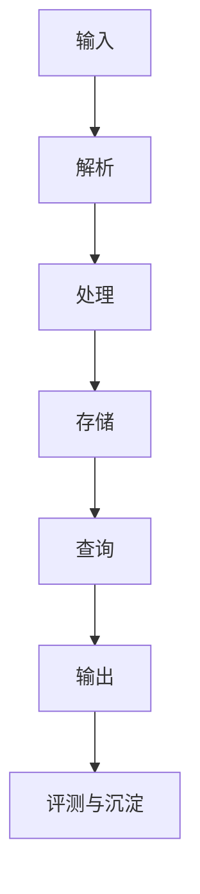

# Strata 通用项目启动模板

> 用途：这是给智能体协作开发项目使用的 launch file。  
> 目标：把“为什么做、做什么、怎么做、如何验证、如何沉淀”提前写清楚，让智能体能稳定地执行需求梳理、规划、开发、测试、迭代和总结。

---

## 1. 项目一句话

用一句话描述这个项目存在的理由。

示例：

> 本项目用于构建一个可验证、可迭代、可文档化维护的智能体开发实验系统。

---

## 2. 项目背景

说明当前问题、已有资产、为什么现在要做。

建议包含：

- 当前遇到的问题是什么。
- 现有代码、数据、文档或实验基础有哪些。
- 这个项目解决后会带来什么价值。
- 哪些事情暂时不做。

---

## 3. 核心目标

列出 3-5 个最重要目标，避免过宽。

示例：

1. 跑通最小端到端流程。
2. 建立可重复验证的测试或评测入口。
3. 把关键决策记录到文档中。
4. 保持实现可维护，避免引入不必要复杂度。

---

## 4. 非目标

明确当前阶段不做什么，防止智能体发散。

示例：

- 暂不做生产级部署。
- 暂不重构无关模块。
- 暂不引入新的大型框架，除非现有方案无法满足。
- 暂不追求完美 UI，先验证核心流程。

---

## 5. 成功标准

定义什么叫“完成”。成功标准应尽量可验证。

示例：

- CLI 或主入口可以按文档命令运行。
- 核心测试通过，或给出无法运行测试的具体原因。
- 输出产物路径、格式、字段含义明确。
- README 能让新用户完成安装和最小使用。
- logs 记录本次改动、验证结果和后续风险。

---

## 6. 系统流程

用文字或图描述项目主流程。

示例：

```text
输入
-> 解析 / 清洗
-> 核心处理
-> 索引 / 存储
-> 查询 / 调用
-> 输出 / 评测
-> 日志 / 知识沉淀
```

如果适合，也可以补充 Mermaid：



---

## 7. 智能体工作流

智能体处理任务时，应按以下顺序推进：

1. **需求梳理**：复述目标、识别输入输出、边界和风险。
2. **上下文读取**：先读 README、AGENTS、plan、logs，再读相关代码。
3. **规划**：拆分小步，明确先做什么、后做什么。
4. **开发**：优先沿用现有代码风格和模块边界。
5. **调试**：遇到失败先定位原因，再决定是否改实现。
6. **测试**：运行最小必要验证，记录命令和结果。
7. **优化迭代**：只优化和当前目标直接相关的部分。
8. **汇总整理**：说明改了什么、怎么验证、还有什么风险。
9. **知识沉淀**：更新 logs / plan / notes 等对应文档。

---

## 8. 文档契约

建议每个项目维护以下文档，职责不要混用。

| 文件 | 职责 |
|------|------|
| `README.md` | 面向用户：安装、使用、输出、验证、当前边界 |
| `AGENTS.md` | 面向智能体：开发规则、验证规则、文档维护规则 |
| `strata.md` | 项目 launch charter：为什么存在、流程、成功标准、文档契约 |
| `CLAUDE.md` | 兼容入口；如有多个 agent，应指向 `AGENTS.md`，避免规范漂移 |
| `plan.md` | 当前技术计划、阶段目标、待办和设计决策 |
| `logs.md` | 追加式运行记录：真实命令、结果、修复、失败、决策 |
| `notes.md` | 背景研究、长笔记、实验想法，不作为当前唯一计划 |

规则：

- 用户怎么运行项目，更新 `README.md`。
- 智能体怎么开发，更新 `AGENTS.md`。
- 项目目标或成功标准变化，更新 `strata.md`。
- 技术路线变化，更新 `plan.md`。
- 真实执行、验证和问题记录，追加 `logs.md`。
- 长材料和研究结论，放入 `notes.md`。

---

## 9. 开发原则

智能体应遵守：

- 先理解现有结构，再修改代码。
- 优先小步、可验证改动。
- 不重构无关文件。
- 不覆盖用户已有改动。
- 不用未经验证的假设更新文档。
- 不把探索笔记写成用户手册。
- 不让 `CLAUDE.md`、`AGENTS.md` 等多套规范互相漂移。
- 每次行为变化都应留下最小验证记录。

---

## 10. 验证策略

按风险选择验证深度。

### 文档改动

```bash
# 示例：检查 CLI help 或文档中的主命令是否仍存在
uv run -m your_package.your_module --help
```

### 小型代码改动

```bash
uv run python -m compileall your_package
uv run pytest tests/test_target.py
```

### 流程改动

```bash
# 示例：跑最小端到端命令
uv run -m your_package.pipeline --input examples/input --out tmp/out --dry-run
```

### 实验改动

```bash
# 示例：跑最小样例集
uv run -m your_package.eval --questions examples/questions.jsonl --limit 3
```

如果无法运行验证，必须记录：

- 缺少什么依赖、密钥、模型或数据。
- 哪些命令已经尝试。
- 失败原因是什么。
- 后续如何补验证。

---

## 11. 日志规范

`logs.md` 建议追加记录，不要覆盖历史。

每次记录至少包含：

```markdown
## N. 标题（YYYY-MM-DD）

目标：

改动：

验证：

结果：

风险 / 后续：
```

示例：

````markdown
## 3. 增加批量评测入口（2026-06-07）

目标：把手工对比升级为可重复实验。

改动：
- 新增 `eval.py`
- 新增 `examples/questions.jsonl`

验证：
```bash
uv run -m package.eval --questions examples/questions.jsonl --limit 3
```

结果：生成 12 行 JSONL，summary 正常。

风险 / 后续：问题集仍小，需要扩充 gold labels。
````

---

## 12. 计划规范

`plan.md` 应维护当前状态，而不是只堆历史。

建议结构：

```markdown
# 项目计划

## 当前状态

## 模块结构

## 阶段目标

## 已完成

## 待办

## 风险

## 决策记录
```

待办建议带优先级：

| 优先级 | 含义 |
|--------|------|
| P0 | 阻塞当前主流程 |
| P1 | 明显影响质量或可用性 |
| P2 | 体验、效率或质量优化 |
| P3 | 长期工程化 |

---

## 13. 交付格式

智能体完成任务后，应简洁说明：

- 改了哪些文件。
- 实现了什么能力。
- 运行了哪些验证。
- 哪些事情没做或仍有风险。
- 下一步建议是什么。

避免只说“已完成”，要给出可追踪证据。

---

## 14. 当前项目填空区

复制本模板到新项目后，优先填写以下内容：

```text
项目名称：

项目一句话：

当前阶段：

主要入口：

输入：

输出：

核心依赖：

成功标准：

当前边界：

下一步：
```

---

## 15. 一句话原则

> Strata 的作用不是替代开发，而是让智能体知道：项目为什么存在、该沿着哪条路推进、怎样判断做完、以及应该把经验沉淀在哪里。
