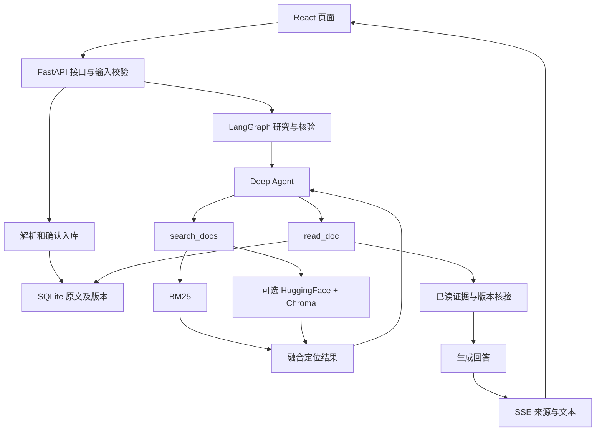

# static1 架构与 API pipeline

更新：2026-09-15。本文区分当前代码契约与后续设计；现有接口以 src/main.py 和运行时 /openapi.json 为准。系统边界与工作流程见 [HLD.md](HLD.md)，启动状态、错误和模块契约见 [LLD.md](LLD.md)。

阅读顺序：先读第1、2节了解系统目标与功能，再用第3、4节查接口；讨论重构看第5节，安排本地与网页端实验看第6节。日常开发优先查阅本文，无需重复通读chat-langchain。

## 1. 顶层架构：本地显式实现文档研究闭环

目标是参照 chat-langchain 的文档交流能力，实现可观察、可测试的本地研究流程：发现相关文档 → 阅读原文 → 核验证据 → 有限补查 → 带来源回答。单用户本地应用，无登录。

固定技术：Python/FastAPI、Deep Agents/LangGraph、React/TypeScript/Tailwind；SQLite保存原文，langchain-chroma保存可选向量，langchain-huggingface加载本地embedding，BM25与dense通过RRF融合。此轮不更换技术选型。



SQLite是可引用原文的事实来源；Chroma是可重建的检索索引。向量命中不能直接代替原文证据。当前核验检查版本与非空文本，不代表已经实现语义充分性判断。

## 2. 上层功能与上游映射

以下路径相对于 third_party/chat-langchain；依据本地源码，不推断云端未公开实现。

| 上游可见设计 | static1 当前映射 | 待补能力 |
|---|---|---|
| instructions.md：先搜索后读取、有限研究 | graph.py 的 search_docs/read_doc、有限补查 | 针对文档问题评估覆盖率、语义充分性 |
| connectors/mcp.py：官方文档MCP声明 | parsers.py网页快照与本地Knowledge | 官方文档目录发现、批量更新；当前没有完整镜像 |
| agent.py：Agent与middleware组合 | graph.py研究/核验/回答、models.py模型入口 | 按失败案例抽取重试与上下文策略 |
| ingress_guards_middleware.py | main.py消息数量、长度和总预算 | 预算策略统一化 |
| summarization_middleware.py | 当前限定历史长度 | 有来源保留规则的历史摘要 |
| frontend/lib/hooks/chat/use-stream-handler.ts | frontend/src/api.ts SSE状态、正文、中断 | run_id、耗时、可复盘的工具事件 |
| identity.py托管身份及线程归属 | 本地单用户、请求级状态 | 本地持久会话，不照搬账号系统 |
| connectors/langsmith.py反馈与trace访问 | 可选LangSmith tracing | 本地反馈、执行记录与评估关联 |
| src/tools/link_check_tools.py | 本地来源版本核验 | 外部官方链接可访问性检查，两者不等价 |

Pylon支持文章可能需要凭据，不能当作已公开可获取语料。LangChain、LangGraph、Deep Agents公开Python文档已支持官方目录批量导入；通用网页仍需预览确认。

## 3. 下层 HTTP API：当前契约

新增官方语料接口：`POST /api/official-docs`接收`{sections:["langchain","langgraph","deepagents"]}`，返回202与任务状态；重复启动运行中的任务返回409。`GET /api/official-docs`返回status、total、completed、imported、changed、errors。状态为idle/running/done/partial/error；任务为单进程内存任务，重启不续跑。逐页写入SQLite，失败页保留旧数据。

新增`official_docs.py`负责分区发现、限定官方域名与分区路径、四路并发Markdown下载、逐页导入。网页通用预览接口保持不变。研究节点缓存同一请求的搜索与读取结果，补查复用已有证据，read_doc要求来自本次已发现的文档版本。

请求和响应使用JSON，聊天使用SSE。前端不得依赖内部SQLite、Chroma或Python对象。

| 接口 | 请求 | 成功响应 | 已实现错误 |
|---|---|---|---|
| GET /api/health | 无 | status、model、docs_count、api_key_configured、web_provider | 不验证模型实际连通性 |
| GET /api/documents | 无 | 文档摘要数组，pages为页数、不含正文 | — |
| GET /api/documents/{doc_id} | page=1、start_line=1、可选version | 阅读证据对象 | 404不存在；422页行错误或版本过期 |
| POST /api/ingest/local | 无 | import_defaults的逐文件导入报告 | 单文件失败由导入报告表达 |
| POST /api/web/preview | {url} | preview_id及Document正文 | 422输入/抓取超时；502抓取失败 |
| POST /api/web/confirm/{preview_id} | 无 | doc_id、version、title、changed | 409预览过期 |
| POST /api/chat | {messages:[{role,content}]} | status/sources/token/done/error事件 | 422输入；开始流后用error事件 |

网页预览只保留最近一次，重启失效。确认时使用服务端保存的正文，不接受前端替换正文。导入操作有进程内锁；当前按单进程单用户运行，不宣称多worker一致性。

聊天输入：1–20条消息；role仅user/assistant；每条1–12000字符；总计不超过40000字符；最后一条必须为user。

```text
POST /api/chat
  → 验证请求
  → 创建本次图状态(messages, rounds=0, evidence=[])
  → research：search_docs → read_doc
  → validate：文档存在、版本相同、正文非空
  → 无证据且未到轮数上限：research
  → 否则answer：无证据明确说明；有证据调用模型组织答案
  → sources → token* → done
```

status可在各阶段重复出现。sources包含实际已读正文证据及citation编号；token为{text}；done为{ok:true}。异常输出error:{message}，不得当作成功完成；没有done的断流也属未完成。前端AbortSignal关闭请求；服务器取消当前协程，但不保证立即终止已经在线程中执行的解析/embedding计算。

## 4. 内部 API 与数据边界

| 当前模块/入口 | 输入与输出 | 所属职责 |
|---|---|---|
| parsers.py | 文件/URL → Document(title, origin, kind, parser, pages, captured_at) | 提取内容，不参与模型问答 |
| Knowledge.put | Document → doc_id/version/changed | 按origin稳定标识，按正文计算版本 |
| Knowledge.search(query, limit=6) | → 定位数组(doc_id, version, title, page, start_line, snippet) | 只定位，不输出可替代read的证据 |
| DenseIndex.search | query、同一批全文窗口及定位对象 → 候选位置排名 | 本地embedding、向量同步、dense排名 |
| fuse_rankings | sparse/dense排名 → RRF结果 | 等权、常数60，不直接相加不同量纲分数 |
| Knowledge.read | doc_id/page/start_line/line_count/version → 已读证据 | 校验版本并读取真实正文 |
| build_graph | Knowledge、Settings、可注入model → compiled graph | 研究编排，与HTTP无关 |
| models.py | Settings → 模型/追踪上下文 | 统一模型协议 |
| frontend/src/api.ts | messages、AbortSignal、事件回调 | 解析SSE，不承担检索策略 |

阅读证据包含doc_id、version、title、page、start_line、next_start_line、text、origin、kind、parser、url、snippet；回答阶段再赋citation。页码来自解析器，行号来自规范化阅读视图，不是PDF原版排版行号。

### 检索子pipeline

```text
SQLite当前文档 → 统一页/行窗口
  ├─ BM25Plus → sparse排名
  └─ 配置embedding_path时：
       加载本地模型 → 同步新增/变化窗口到Chroma → 清理旧窗口 → dense排名
       两路各取max(20, limit*3)候选 → RRF → 最终limit条定位
空embedding_path：仅BM25 → 最终limit条定位
```

最终limit限制1–10。Chroma元数据当前只存chunk_id，完整来源由同次候选快照还原。首次搜索建索引；同一索引对象内有锁。切模型/提示/文件状态会换集合，旧集合保留。模型文件变化需重启已加载的实例。仍需补并发导入/查询、整库索引耗时和混合检索收益评估。

## 5. 分层与解耦的后续落地

当前main.py同时承担路由、预览状态和导入协调；Knowledge同时承担存储和检索组装。它们是当前实现，不应描述成已经彻底分层。

下一次按功能改动逐步拆分，保持HTTP契约与search/read契约：

1. api层：Pydantic请求/响应、路由、SSE编码及状态码；不写检索规则。
2. application层：入库、网页预览确认、问答用例；管理锁、取消、事务边界。
3. retrieval层：统一窗口、BM25/dense/RRF及索引同步；不依赖FastAPI。
4. storage/parsers层：SQLite原文、Chroma索引、解析器和本地模型实现。
5. agent层：只通过search/read获取知识，研究预算与回答策略独立于存储实现。

先借助现有注入点Knowledge、graph_factory、model建立契约测试，再移动代码；不为每个函数新增抽象类。解析器无需知道Agent，React无需知道向量库。新增run_id、持久会话和反馈前先定义数据生命周期，再增加接口；本次不把规划接口伪装成可调用接口。

## 6. 官方文档与网页端对照路线（待实现）

进度补充：Python三分区官方文档发现与批量更新现已实现，侧栏可操作；来源卡片支持官方原文链接，对话可导出JSON。下面的统一问题集与人工网页对照仍由用户后续开展，不代表已经验证答案质量。

1. 固定LangChain/LangGraph/Deep Agents文档URL清单，记录获取时间与内容版本；先小样本，再批量发现与更新。
2. 用同组问题比较：单页事实、多页组合、追问、过时API、无答案、证据冲突。保存问题、答案、已读来源、模型、语料版本与耗时。
3. 本地分别跑BM25与dense+BM25，衡量来源召回、正文覆盖、答案正确性、引用支持率、延迟和成本。将失败案例变成回归样例。
4. 网页端结果由本地实际观察记录；托管模型和语料版本不可完全控制，因此比较用于定位缺口，不当作严格同条件排名。

当前retrieval_v4只覆盖工程文本8例，不代表官方技术文档效果。下一里程碑是官方文档导入清单与评估集，再根据结果决定摘要、反馈与持久会话的优先级。

## 7. 参考索引与维护约定

本次沉淀基于本地仓库快照，不是对上游未来版本的保证。需要核对细节时按职责打开对应文件：

- [上游研究策略](../third_party/chat-langchain/instructions.md)：搜索与阅读分离、有限研究、引用要求。
- [上游Agent入口](../third_party/chat-langchain/agent.py)：工具和中间件如何组合。
- [文档MCP声明](../third_party/chat-langchain/connectors/mcp.py)：公开的文档服务接入点；不包含服务端索引实现。
- [身份契约](../third_party/chat-langchain/identity.py)：托管身份与线程归属边界。
- [追踪与反馈契约](../third_party/chat-langchain/connectors/langsmith.py)：浏览器可调用能力与服务端凭据隔离。
- [流处理](../third_party/chat-langchain/frontend/lib/hooks/chat/use-stream-handler.ts)：状态、工具事件及中断。
- [本地接口](src/main.py)、[本地图](src/agent/graph.py)、[本地检索](src/knowledge.py)、[向量实现](src/dense.py)：本文当前契约的依据。

维护规则：改接口时同步第3、4节；改职责时同步第5节和IMPLEMENTATION.md；功能验收后更新Strata状态，并将任务、实现情况、分析评价、验证证据追加到dev_logs.md。只有上游升级、契约不明或具体缺陷需要溯源时重新查参考仓库。未公开的托管能力只记录可见输入输出，不猜测内部实现。
